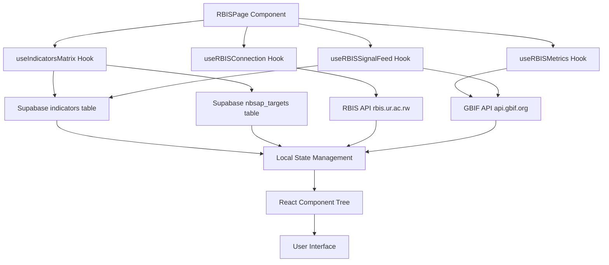

# Technical Design Document

## Overview

This document specifies the technical design for the RBIS (Rwanda Biodiversity Information System) Comprehensive Dashboard. The dashboard transforms the current technical architecture-focused RBIS page into a comprehensive monitoring and tracking interface that provides:

- **Live Connection Management**: Real-time RBIS connection status and controls
- **Real-Time Metrics**: Live biodiversity data statistics from RBIS and GBIF
- **Indicators-Targets Matrix**: Complete registry of 79 indicators across 22 national targets organized by 4 GBF goals
- **RBIS Linkage Tracking**: Visual mapping of which indicators are connected to RBIS data streams
- **Progress Monitoring**: Progress percentages and on-track status for each indicator
- **Live Signal Feed**: Real-time biodiversity data streams mapped to specific targets
- **Search and Filter**: Comprehensive search and filtering capabilities

The design leverages the existing React/TypeScript architecture, Supabase backend, and established patterns from `useData.ts`, `dataService.ts`, and the GBIF integration in `useGBIF.ts`.

### Design Principles

1. **Consistency**: Follow existing component patterns and styling conventions
2. **Reusability**: Leverage existing hooks and services where possible
3. **Performance**: Implement efficient data fetching with caching and auto-refresh
4. **Type Safety**: Comprehensive TypeScript interfaces for all data structures
5. **Maintainability**: Clear separation of concerns between UI, data, and business logic

## Architecture

### High-Level Component Structure

```
RBISPage (Container)
├── ConnectionBar (Connection Status & Controls)
├── MetricsPanel (Real-Time RBIS Statistics)
├── IndicatorsMatrix (Indicators × Targets × RBIS Registry)
│   ├── SearchBar (Search & Filter Controls)
│   ├── GBFGoalSection (Collapsible Goal Container)
│   │   ├── TargetSection (Collapsible Target Container)
│   │   │   ├── IndicatorRow (Individual Indicator Display)
│   │   │   │   ├── ProgressBar
│   │   │   │   ├── StatusBadge
│   │   │   │   └── RBISLinkageBadge
└── SignalFeed (Live Data Streams)
    └── DataStreamCard (Individual Stream Display)
```

### Data Flow Architecture



### State Management Approach

The dashboard uses **React hooks** for state management, following the established pattern in `useData.ts`:

- **Local Component State**: For UI-specific state (expanded sections, search terms, filters)
- **Custom Hooks**: For data fetching, caching, and auto-refresh logic
- **Shared State**: Minimal - only for cross-component communication (e.g., scroll-to-target)

### Integration Points

1. **Existing Services**:
   - `dataService.ts`: Supabase queries for indicators and targets
   - `useData.ts`: Reusable data fetching patterns
   - `useGBIF.ts`: GBIF API integration pattern

2. **New Services**:
   - `rbisService.ts`: RBIS API integration
   - `useRBIS.ts`: Custom hooks for RBIS data

3. **Database Tables**:
   - `indicators`: Existing table with progress and status
   - `nbsap_targets`: Existing table with target information
   - `rbis_linkages`: New table for indicator-to-RBIS mappings
   - `rbis_data_streams`: New table for data stream definitions

## Components and Interfaces

### 1. ConnectionBar Component

**Purpose**: Display RBIS connection status and provide connection controls

**Props Interface**:
```typescript
interface ConnectionBarProps {
  status: RBISConnectionStatus;
  serverUrl: string;
  onConnect: () => void;
  onDisconnect: () => void;
  lastSync?: string;
}

type RBISConnectionStatus = 'connected' | 'disconnected' | 'connecting' | 'error';
```

**State**:
```typescript
interface ConnectionBarState {
  isConnecting: boolean;
  errorMessage: string | null;
}
```

**Visual Design**:
- Green indicator + "Connected to RBIS" when connected
- Red indicator + "Disconnected" when disconnected
- Yellow indicator + "Connecting..." when connecting
- Red indicator + error message when error
- Connect/Disconnect button
- Server URL display (rbis.ur.ac.rw)

### 2. MetricsPanel Component

**Purpose**: Display real-time RBIS metrics and recent occurrence records

**Props Interface**:
```typescript
interface MetricsPanelProps {
  metrics: RBISMetrics;
  recentRecords: RBISOccurrence[];
  loading: boolean;
  lastUpdate: string;
}

interface RBISMetrics {
  totalOccurrences: number;
  last24Hours: number;
  last7Days: number;
  activeDataStreams: number;
  lastDataUpdate: string;
}

interface RBISOccurrence {
  id: string;
  scientificName: string;
  location: string;
  timestamp: string;
  dataStream: string;
}
```

**Features**:
- Auto-refresh every 30 seconds when RBIS is connected
- Display 5 most recent occurrence records
- Metric cards with icons and color coding
- Loading states for each metric

### 3. IndicatorsMatrix Component

**Purpose**: Display complete registry of indicators, targets, and RBIS linkages with search/filter

**Props Interface**:
```typescript
interface IndicatorsMatrixProps {
  goals: GBFGoal[];
  searchTerm: string;
  activeFilter: GBFGoalFilter;
  onSearchChange: (term: string) => void;
  onFilterChange: (filter: GBFGoalFilter) => void;
  onTargetClick: (targetId: number) => void;
}

interface GBFGoal {
  id: 'A' | 'B' | 'C' | 'D';
  title: string;
  description: string;
  targets: NBSAPTarget[];
  averageProgress: number;
}

interface NBSAPTarget {
  id: number;
  goalId: 'A' | 'B' | 'C' | 'D';
  number: string; // e.g., "Target 1"
  title: string;
  description: string;
  indicators: Indicator[];
  averageProgress: number;
}

interface Indicator {
  id: number;
  targetId: number;
  number: string; // e.g., "1.1"
  title: string;
  measurementUnit: string;
  progress: number; // 0-100
  status: 'on-track' | 'at-risk' | 'off-track';
  rbisLinkage: RBISLinkage;
}

interface RBISLinkage {
  status: 'linked' | 'not-linked' | 'partial';
  dataStreams: string[]; // Names of connected RBIS data streams
}

type GBFGoalFilter = 'all' | 'A' | 'B' | 'C' | 'D';
```

**State**:
```typescript
interface IndicatorsMatrixState {
  expandedGoals: Set<string>; // Goal IDs that are expanded
  expandedTargets: Set<number>; // Target IDs that are expanded
  searchTerm: string;
  activeFilter: GBFGoalFilter;
  filteredData: GBFGoal[];
}
```

**Features**:
- Collapsible goal sections (4 GBF goals)
- Collapsible target sections (22 targets)
- Indicator rows with progress bars, status badges, RBIS linkage badges
- Search across target titles, descriptions, indicator titles, indicator numbers
- Filter by GBF goal (A, B, C, D, All)
- Display total counts: targets, indicators, linked indicators, percentage linked
- Highlight active filter button
- "No results found" message when search/filter yields no matches

### 4. SignalFeed Component

**Purpose**: Display live RBIS data streams mapped to national targets

**Props Interface**:
```typescript
interface SignalFeedProps {
  dataStreams: RBISDataStream[];
  loading: boolean;
  onTargetClick: (targetId: number) => void;
}

interface RBISDataStream {
  id: string;
  name: string;
  description: string;
  targetNumbers: number[]; // National target IDs this stream supports
  occurrenceCount: number;
  status: 'active' | 'inactive' | 'error';
  errorMessage?: string;
  lastUpdate: string;
}
```

**Supported Data Streams**:
1. Protected Areas Coverage
2. Threatened Species Monitoring
3. Forest Cover Change
4. Wetland Extent
5. Species Distribution
6. Invasive Species Tracking
7. Ecosystem Restoration
8. Sustainable Use Indicators

**Features**:
- Auto-refresh occurrence counts every 60 seconds
- Color-coded status indicators (green=active, gray=inactive, red=error)
- Clickable target numbers that scroll to and highlight target in matrix
- Display total active streams and total occurrence records
- Error details when stream has error status

## Data Models

### TypeScript Interfaces

```typescript
// ── RBIS Connection ──────────────────────────────────────────

export interface RBISConnection {
  status: RBISConnectionStatus;
  serverUrl: string;
  lastSync: string | null;
  error: string | null;
}

export type RBISConnectionStatus = 'connected' | 'disconnected' | 'connecting' | 'error';

// ── RBIS Metrics ─────────────────────────────────────────────

export interface RBISMetrics {
  totalOccurrences: number;
  last24Hours: number;
  last7Days: number;
  activeDataStreams: number;
  lastDataUpdate: string;
}

export interface RBISOccurrence {
  id: string;
  scientificName: string;
  location: string;
  timestamp: string;
  dataStream: string;
  coordinates?: {
    latitude: number;
    longitude: number;
  };
}

// ── Indicators and Targets ───────────────────────────────────

export interface GBFGoal {
  id: 'A' | 'B' | 'C' | 'D';
  title: string;
  description: string;
  targets: NBSAPTarget[];
  averageProgress: number;
}

export interface NBSAPTarget {
  id: number;
  goalId: 'A' | 'B' | 'C' | 'D';
  number: string;
  title: string;
  description: string;
  indicators: Indicator[];
  averageProgress: number;
}

export interface Indicator {
  id: number;
  targetId: number;
  number: string;
  title: string;
  definition: string;
  measurementUnit: string;
  progress: number;
  status: IndicatorStatus;
  rbisLinkage: RBISLinkage;
  baseline: string;
  target2030: string;
  currentValue: string;
}

export type IndicatorStatus = 'on-track' | 'at-risk' | 'off-track';

export interface RBISLinkage {
  status: RBISLinkageStatus;
  dataStreams: string[];
  lastSync?: string;
}

export type RBISLinkageStatus = 'linked' | 'not-linked' | 'partial';

// ── RBIS Data Streams ────────────────────────────────────────

export interface RBISDataStream {
  id: string;
  name: string;
  description: string;
  targetNumbers: number[];
  occurrenceCount: number;
  status: DataStreamStatus;
  errorMessage?: string;
  lastUpdate: string;
  icon?: string;
  color?: string;
}

export type DataStreamStatus = 'active' | 'inactive' | 'error';

// ── Filter and Search ────────────────────────────────────────

export type GBFGoalFilter = 'all' | 'A' | 'B' | 'C' | 'D';

export interface SearchFilters {
  searchTerm: string;
  goalFilter: GBFGoalFilter;
  statusFilter?: IndicatorStatus | 'all';
  linkageFilter?: RBISLinkageStatus | 'all';
}

// ── Dashboard Summary ────────────────────────────────────────

export interface RBISDashboardSummary {
  totalTargets: number;
  totalIndicators: number;
  linkedIndicators: number;
  linkagePercentage: number;
  onTrackIndicators: number;
  atRiskIndicators: number;
  offTrackIndicators: number;
  activeDataStreams: number;
  totalOccurrences: number;
}
```

### Database Schema Extensions

**New Table: `rbis_linkages`**
```sql
CREATE TABLE rbis_linkages (
  id SERIAL PRIMARY KEY,
  indicator_id INTEGER NOT NULL REFERENCES indicators(id) ON DELETE CASCADE,
  data_stream_id VARCHAR(100) NOT NULL,
  linkage_status VARCHAR(20) NOT NULL CHECK (linkage_status IN ('linked', 'not-linked', 'partial')),
  last_sync TIMESTAMPTZ,
  created_at TIMESTAMPTZ DEFAULT NOW(),
  updated_at TIMESTAMPTZ DEFAULT NOW()
);

CREATE INDEX idx_rbis_linkages_indicator ON rbis_linkages(indicator_id);
CREATE INDEX idx_rbis_linkages_stream ON rbis_linkages(data_stream_id);
```

**New Table: `rbis_data_streams`**
```sql
CREATE TABLE rbis_data_streams (
  id VARCHAR(100) PRIMARY KEY,
  name VARCHAR(255) NOT NULL,
  description TEXT,
  target_numbers INTEGER[] NOT NULL,
  occurrence_count INTEGER DEFAULT 0,
  status VARCHAR(20) NOT NULL CHECK (status IN ('active', 'inactive', 'error')),
  error_message TEXT,
  last_update TIMESTAMPTZ,
  icon VARCHAR(50),
  color VARCHAR(20),
  created_at TIMESTAMPTZ DEFAULT NOW(),
  updated_at TIMESTAMPTZ DEFAULT NOW()
);

CREATE INDEX idx_rbis_streams_status ON rbis_data_streams(status);
```

**New Table: `rbis_connection_log`**
```sql
CREATE TABLE rbis_connection_log (
  id SERIAL PRIMARY KEY,
  status VARCHAR(20) NOT NULL,
  server_url VARCHAR(255) NOT NULL,
  error_message TEXT,
  user_id UUID REFERENCES auth.users(id),
  created_at TIMESTAMPTZ DEFAULT NOW()
);

CREATE INDEX idx_rbis_connection_log_created ON rbis_connection_log(created_at DESC);
```

## API Integration Functions

### RBIS Service (`rbisService.ts`)

```typescript
import { supabase } from './supabase';
import type {
  RBISConnection,
  RBISMetrics,
  RBISOccurrence,
  RBISDataStream,
  RBISLinkage,
} from './index';

const RBIS_BASE_URL = 'https://rbis.ur.ac.rw/api';
const GBIF_BASE_URL = 'https://api.gbif.org/v1';
const RWANDA_CODE = 'RW';

// ── RBIS Connection Management ───────────────────────────────

export async function connectToRBIS(): Promise<RBISConnection> {
  try {
    const response = await fetch(`${RBIS_BASE_URL}/health`, {
      method: 'GET',
      headers: { 'Accept': 'application/json' },
    });

    if (!response.ok) {
      throw new Error(`RBIS connection failed: ${response.status}`);
    }

    const data = await response.json();
    
    // Log connection event
    await logRBISConnection('connected', null);

    return {
      status: 'connected',
      serverUrl: 'rbis.ur.ac.rw',
      lastSync: new Date().toISOString(),
      error: null,
    };
  } catch (error) {
    const errorMessage = error instanceof Error ? error.message : 'Unknown error';
    await logRBISConnection('error', errorMessage);
    
    return {
      status: 'error',
      serverUrl: 'rbis.ur.ac.rw',
      lastSync: null,
      error: errorMessage,
    };
  }
}

export async function disconnectFromRBIS(): Promise<void> {
  await logRBISConnection('disconnected', null);
}

async function logRBISConnection(
  status: string,
  errorMessage: string | null
): Promise<void> {
  const { data: sessionData } = await supabase.auth.getSession();
  
  await supabase.from('rbis_connection_log').insert({
    status,
    server_url: 'rbis.ur.ac.rw',
    error_message: errorMessage,
    user_id: sessionData.session?.user.id || null,
  });
}

// ── RBIS Metrics ──────────────────────────────────────────────

export async function fetchRBISMetrics(): Promise<RBISMetrics> {
  // Fetch from GBIF API (RBIS data is published to GBIF)
  const [total, last24h, last7d] = await Promise.all([
    fetchGBIFCount({}),
    fetchGBIFCount({ eventDate: getDateRange(1) }),
    fetchGBIFCount({ eventDate: getDateRange(7) }),
  ]);

  // Fetch active data streams count
  const { count: activeStreams } = await supabase
    .from('rbis_data_streams')
    .select('id', { count: 'exact', head: true })
    .eq('status', 'active');

  return {
    totalOccurrences: total,
    last24Hours: last24h,
    last7Days: last7d,
    activeDataStreams: activeStreams || 0,
    lastDataUpdate: new Date().toISOString(),
  };
}

async function fetchGBIFCount(params: Record<string, string>): Promise<number> {
  const queryParams = new URLSearchParams({
    country: RWANDA_CODE,
    limit: '0',
    ...params,
  });

  const response = await fetch(`${GBIF_BASE_URL}/occurrence/search?${queryParams}`);
  if (!response.ok) throw new Error('GBIF API error');
  
  const data = await response.json();
  return data.count || 0;
}

function getDateRange(days: number): string {
  const now = new Date();
  const past = new Date(now.getTime() - days * 24 * 60 * 60 * 1000);
  return `${past.toISOString().split('T')[0]},${now.toISOString().split('T')[0]}`;
}

// ── Recent Occurrences ────────────────────────────────────────

export async function fetchRecentOccurrences(limit = 5): Promise<RBISOccurrence[]> {
  const queryParams = new URLSearchParams({
    country: RWANDA_CODE,
    limit: limit.toString(),
    hasCoordinate: 'true',
  });

  const response = await fetch(`${GBIF_BASE_URL}/occurrence/search?${queryParams}`);
  if (!response.ok) throw new Error('GBIF API error');
  
  const data = await response.json();
  
  return (data.results || []).map((record: any) => ({
    id: record.key.toString(),
    scientificName: record.scientificName || 'Unknown',
    location: record.stateProvince || record.locality || 'Rwanda',
    timestamp: record.eventDate || record.modified || new Date().toISOString(),
    dataStream: record.datasetName || 'GBIF',
    coordinates: record.decimalLatitude && record.decimalLongitude ? {
      latitude: record.decimalLatitude,
      longitude: record.decimalLongitude,
    } : undefined,
  }));
}

// ── Indicators with RBIS Linkages ─────────────────────────────

export async function fetchIndicatorsWithLinkages(): Promise<Indicator[]> {
  const { data: indicators, error } = await supabase
    .from('indicators')
    .select(`
      *,
      rbis_linkages (
        linkage_status,
        data_stream_id,
        last_sync
      )
    `)
    .order('id', { ascending: true });

  if (error) {
    console.error('fetchIndicatorsWithLinkages error:', error);
    return [];
  }

  return (indicators || []).map((ind: any) => ({
    id: ind.id,
    targetId: ind.nbsap_target_id,
    number: `${ind.nbsap_target_id}.${ind.id}`,
    title: ind.name,
    definition: ind.definition,
    measurementUnit: ind.periodicity || 'Annual',
    progress: ind.progress || 0,
    status: ind.status || 'behind',
    baseline: ind.baseline,
    target2030: ind.final_target,
    currentValue: ind.current_value,
    rbisLinkage: {
      status: ind.rbis_linkages?.[0]?.linkage_status || 'not-linked',
      dataStreams: ind.rbis_linkages?.map((l: any) => l.data_stream_id) || [],
      lastSync: ind.rbis_linkages?.[0]?.last_sync,
    },
  }));
}

// ── Targets with Indicators ───────────────────────────────────

export async function fetchTargetsWithIndicators(): Promise<NBSAPTarget[]> {
  const { data: targets, error } = await supabase
    .from('nbsap_targets')
    .select('*')
    .order('id', { ascending: true });

  if (error) {
    console.error('fetchTargetsWithIndicators error:', error);
    return [];
  }

  const indicators = await fetchIndicatorsWithLinkages();
  
  return (targets || []).map((target: any) => {
    const targetIndicators = indicators.filter(ind => ind.targetId === target.id);
    const avgProgress = targetIndicators.length > 0
      ? Math.round(targetIndicators.reduce((sum, ind) => sum + ind.progress, 0) / targetIndicators.length)
      : 0;

    return {
      id: target.id,
      goalId: target.goal,
      number: `Target ${target.id}`,
      title: target.title,
      description: target.description,
      indicators: targetIndicators,
      averageProgress: avgProgress,
    };
  });
}

// ── GBF Goals with Targets ────────────────────────────────────

export async function fetchGBFGoals(): Promise<GBFGoal[]> {
  const targets = await fetchTargetsWithIndicators();
  
  const goalDefinitions = [
    { id: 'A' as const, title: 'Goal A: Ecosystem Integrity', description: 'Maintain and restore ecosystem integrity' },
    { id: 'B' as const, title: 'Goal B: Sustainable Use', description: 'Ensure sustainable use and benefit-sharing' },
    { id: 'C' as const, title: 'Goal C: Benefit Sharing', description: 'Fair and equitable sharing of benefits' },
    { id: 'D' as const, title: 'Goal D: Implementation', description: 'Adequate means of implementation' },
  ];

  return goalDefinitions.map(goal => {
    const goalTargets = targets.filter(t => t.goalId === goal.id);
    const avgProgress = goalTargets.length > 0
      ? Math.round(goalTargets.reduce((sum, t) => sum + t.averageProgress, 0) / goalTargets.length)
      : 0;

    return {
      ...goal,
      targets: goalTargets,
      averageProgress: avgProgress,
    };
  });
}

// ── RBIS Data Streams ─────────────────────────────────────────

export async function fetchRBISDataStreams(): Promise<RBISDataStream[]> {
  const { data: streams, error } = await supabase
    .from('rbis_data_streams')
    .select('*')
    .order('name', { ascending: true });

  if (error) {
    console.error('fetchRBISDataStreams error:', error);
    return [];
  }

  return (streams || []).map((stream: any) => ({
    id: stream.id,
    name: stream.name,
    description: stream.description,
    targetNumbers: stream.target_numbers || [],
    occurrenceCount: stream.occurrence_count || 0,
    status: stream.status,
    errorMessage: stream.error_message,
    lastUpdate: stream.last_update || new Date().toISOString(),
    icon: stream.icon,
    color: stream.color,
  }));
}

// ── Update Data Stream Occurrence Count ───────────────────────

export async function updateDataStreamCount(
  streamId: string,
  count: number
): Promise<void> {
  await supabase
    .from('rbis_data_streams')
    .update({
      occurrence_count: count,
      last_update: new Date().toISOString(),
    })
    .eq('id', streamId);
}

// ── Dashboard Summary ─────────────────────────────────────────

export async function fetchRBISDashboardSummary(): Promise<RBISDashboardSummary> {
  const [goals, streams, metrics] = await Promise.all([
    fetchGBFGoals(),
    fetchRBISDataStreams(),
    fetchRBISMetrics(),
  ]);

  const allIndicators = goals.flatMap(g => g.targets.flatMap(t => t.indicators));
  const linkedIndicators = allIndicators.filter(i => i.rbisLinkage.status === 'linked');
  const linkagePercentage = allIndicators.length > 0
    ? Math.round((linkedIndicators.length / allIndicators.length) * 100)
    : 0;

  return {
    totalTargets: goals.flatMap(g => g.targets).length,
    totalIndicators: allIndicators.length,
    linkedIndicators: linkedIndicators.length,
    linkagePercentage,
    onTrackIndicators: allIndicators.filter(i => i.status === 'on-track').length,
    atRiskIndicators: allIndicators.filter(i => i.status === 'at-risk').length,
    offTrackIndicators: allIndicators.filter(i => i.status === 'off-track').length,
    activeDataStreams: streams.filter(s => s.status === 'active').length,
    totalOccurrences: metrics.totalOccurrences,
  };
}
```

### Custom Hooks (`useRBIS.ts`)

```typescript
import { useState, useEffect, useCallback, useRef } from 'react';
import {
  connectToRBIS,
  disconnectFromRBIS,
  fetchRBISMetrics,
  fetchRecentOccurrences,
  fetchGBFGoals,
  fetchRBISDataStreams,
  fetchRBISDashboardSummary,
} from './rbisService';
import type {
  RBISConnection,
  RBISMetrics,
  RBISOccurrence,
  GBFGoal,
  RBISDataStream,
  RBISDashboardSummary,
} from './index';

// ── RBIS Connection Hook ──────────────────────────────────────

export function useRBISConnection() {
  const [connection, setConnection] = useState<RBISConnection>({
    status: 'disconnected',
    serverUrl: 'rbis.ur.ac.rw',
    lastSync: null,
    error: null,
  });
  const [loading, setLoading] = useState(false);

  const connect = useCallback(async () => {
    setLoading(true);
    setConnection(prev => ({ ...prev, status: 'connecting', error: null }));
    
    const result = await connectToRBIS();
    setConnection(result);
    setLoading(false);
  }, []);

  const disconnect = useCallback(async () => {
    await disconnectFromRBIS();
    setConnection({
      status: 'disconnected',
      serverUrl: 'rbis.ur.ac.rw',
      lastSync: null,
      error: null,
    });
  }, []);

  return { connection, loading, connect, disconnect };
}

// ── RBIS Metrics Hook ─────────────────────────────────────────

export function useRBISMetrics(autoRefresh = true, refreshInterval = 30000) {
  const [metrics, setMetrics] = useState<RBISMetrics | null>(null);
  const [recentOccurrences, setRecentOccurrences] = useState<RBISOccurrence[]>([]);
  const [loading, setLoading] = useState(true);
  const [error, setError] = useState<string | null>(null);
  const mountedRef = useRef(true);

  const load = useCallback(async () => {
    setLoading(true);
    setError(null);
    
    try {
      const [metricsData, occurrences] = await Promise.all([
        fetchRBISMetrics(),
        fetchRecentOccurrences(5),
      ]);
      
      if (mountedRef.current) {
        setMetrics(metricsData);
        setRecentOccurrences(occurrences);
      }
    } catch (err) {
      if (mountedRef.current) {
        setError(err instanceof Error ? err.message : 'Failed to load metrics');
      }
    } finally {
      if (mountedRef.current) {
        setLoading(false);
      }
    }
  }, []);

  useEffect(() => {
    mountedRef.current = true;
    load();
    return () => { mountedRef.current = false; };
  }, [load]);

  // Auto-refresh
  useEffect(() => {
    if (!autoRefresh) return;
    const interval = setInterval(load, refreshInterval);
    return () => clearInterval(interval);
  }, [autoRefresh, refreshInterval, load]);

  return { metrics, recentOccurrences, loading, error, refetch: load };
}

// ── Indicators Matrix Hook ────────────────────────────────────

export function useIndicatorsMatrix() {
  const [goals, setGoals] = useState<GBFGoal[]>([]);
  const [loading, setLoading] = useState(true);
  const [error, setError] = useState<string | null>(null);
  const mountedRef = useRef(true);

  const load = useCallback(async () => {
    setLoading(true);
    setError(null);
    
    try {
      const data = await fetchGBFGoals();
      if (mountedRef.current) {
        setGoals(data);
      }
    } catch (err) {
      if (mountedRef.current) {
        setError(err instanceof Error ? err.message : 'Failed to load indicators');
      }
    } finally {
      if (mountedRef.current) {
        setLoading(false);
      }
    }
  }, []);

  useEffect(() => {
    mountedRef.current = true;
    load();
    return () => { mountedRef.current = false; };
  }, [load]);

  return { goals, loading, error, refetch: load };
}

// ── RBIS Signal Feed Hook ─────────────────────────────────────

export function useRBISSignalFeed(autoRefresh = true, refreshInterval = 60000) {
  const [dataStreams, setDataStreams] = useState<RBISDataStream[]>([]);
  const [loading, setLoading] = useState(true);
  const [error, setError] = useState<string | null>(null);
  const mountedRef = useRef(true);

  const load = useCallback(async () => {
    setLoading(true);
    setError(null);
    
    try {
      const data = await fetchRBISDataStreams();
      if (mountedRef.current) {
        setDataStreams(data);
      }
    } catch (err) {
      if (mountedRef.current) {
        setError(err instanceof Error ? err.message : 'Failed to load data streams');
      }
    } finally {
      if (mountedRef.current) {
        setLoading(false);
      }
    }
  }, []);

  useEffect(() => {
    mountedRef.current = true;
    load();
    return () => { mountedRef.current = false; };
  }, [load]);

  // Auto-refresh
  useEffect(() => {
    if (!autoRefresh) return;
    const interval = setInterval(load, refreshInterval);
    return () => clearInterval(interval);
  }, [autoRefresh, refreshInterval, load]);

  return { dataStreams, loading, error, refetch: load };
}

// ── Dashboard Summary Hook ────────────────────────────────────

export function useRBISDashboardSummary() {
  const [summary, setSummary] = useState<RBISDashboardSummary | null>(null);
  const [loading, setLoading] = useState(true);
  const [error, setError] = useState<string | null>(null);
  const mountedRef = useRef(true);

  const load = useCallback(async () => {
    setLoading(true);
    setError(null);
    
    try {
      const data = await fetchRBISDashboardSummary();
      if (mountedRef.current) {
        setSummary(data);
      }
    } catch (err) {
      if (mountedRef.current) {
        setError(err instanceof Error ? err.message : 'Failed to load summary');
      }
    } finally {
      if (mountedRef.current) {
        setLoading(false);
      }
    }
  }, []);

  useEffect(() => {
    mountedRef.current = true;
    load();
    return () => { mountedRef.current = false; };
  }, [load]);

  return { summary, loading, error, refetch: load };
}
```

## Filtering and Search Algorithms

### Search Algorithm

The search functionality filters indicators and targets based on user input:

```typescript
function filterBySearch(
  goals: GBFGoal[],
  searchTerm: string
): GBFGoal[] {
  if (!searchTerm.trim()) return goals;

  const term = searchTerm.toLowerCase();

  return goals.map(goal => ({
    ...goal,
    targets: goal.targets
      .map(target => ({
        ...target,
        indicators: target.indicators.filter(indicator =>
          indicator.title.toLowerCase().includes(term) ||
          indicator.number.toLowerCase().includes(term) ||
          target.title.toLowerCase().includes(term) ||
          target.description.toLowerCase().includes(term)
        ),
      }))
      .filter(target => target.indicators.length > 0),
  })).filter(goal => goal.targets.length > 0);
}
```

**Algorithm Complexity**: O(n × m × k) where:
- n = number of goals (4)
- m = average targets per goal (~5.5)
- k = average indicators per target (~3.6)
- Total: ~79 indicators to search

**Performance**: Acceptable for real-time search with <100ms latency

### Filter Algorithm

The filter functionality filters by GBF goal:

```typescript
function filterByGoal(
  goals: GBFGoal[],
  goalFilter: GBFGoalFilter
): GBFGoal[] {
  if (goalFilter === 'all') return goals;
  return goals.filter(goal => goal.id === goalFilter);
}
```

**Algorithm Complexity**: O(n) where n = 4 goals

### Combined Filter and Search

```typescript
function applyFilters(
  goals: GBFGoal[],
  filters: SearchFilters
): GBFGoal[] {
  let filtered = goals;

  // Apply goal filter first (reduces dataset)
  filtered = filterByGoal(filtered, filters.goalFilter);

  // Apply search term
  filtered = filterBySearch(filtered, filters.searchTerm);

  // Apply status filter if provided
  if (filters.statusFilter && filters.statusFilter !== 'all') {
    filtered = filtered.map(goal => ({
      ...goal,
      targets: goal.targets.map(target => ({
        ...target,
        indicators: target.indicators.filter(
          ind => ind.status === filters.statusFilter
        ),
      })).filter(target => target.indicators.length > 0),
    })).filter(goal => goal.targets.length > 0);
  }

  // Apply linkage filter if provided
  if (filters.linkageFilter && filters.linkageFilter !== 'all') {
    filtered = filtered.map(goal => ({
      ...goal,
      targets: goal.targets.map(target => ({
        ...target,
        indicators: target.indicators.filter(
          ind => ind.rbisLinkage.status === filters.linkageFilter
        ),
      })).filter(target => target.indicators.length > 0),
    })).filter(goal => goal.targets.length > 0);
  }

  return filtered;
}
```

## Progress Calculation Logic

### Indicator Status Calculation

Indicator status is determined by comparing current progress to expected progress:

```typescript
function calculateIndicatorStatus(
  progress: number,
  expectedProgress: number
): IndicatorStatus {
  const ratio = progress / expectedProgress;

  if (ratio >= 0.8) return 'on-track';
  if (ratio >= 0.5) return 'at-risk';
  return 'off-track';
}
```

**Expected Progress Calculation**:
```typescript
function calculateExpectedProgress(
  startDate: Date,
  endDate: Date,
  currentDate: Date = new Date()
): number {
  const totalDuration = endDate.getTime() - startDate.getTime();
  const elapsed = currentDate.getTime() - startDate.getTime();
  
  return Math.min(100, Math.max(0, (elapsed / totalDuration) * 100));
}
```

For NBSAP 2025-2030:
- Start: January 1, 2025
- End: December 31, 2030
- Current expected progress (2025): ~0-20%

### Target Average Progress

```typescript
function calculateTargetProgress(indicators: Indicator[]): number {
  if (indicators.length === 0) return 0;
  
  const totalProgress = indicators.reduce((sum, ind) => sum + ind.progress, 0);
  return Math.round(totalProgress / indicators.length);
}
```

### Goal Average Progress

```typescript
function calculateGoalProgress(targets: NBSAPTarget[]): number {
  if (targets.length === 0) return 0;
  
  const totalProgress = targets.reduce((sum, target) => sum + target.averageProgress, 0);
  return Math.round(totalProgress / targets.length);
}
```

### Linkage Percentage

```typescript
function calculateLinkagePercentage(indicators: Indicator[]): number {
  if (indicators.length === 0) return 0;
  
  const linkedCount = indicators.filter(
    ind => ind.rbisLinkage.status === 'linked'
  ).length;
  
  return Math.round((linkedCount / indicators.length) * 100);
}
```

## Error Handling

### Error Handling Strategy

1. **Network Errors**: Retry with exponential backoff
2. **API Errors**: Display user-friendly error messages with retry button
3. **Data Validation Errors**: Log to console, use fallback values
4. **Component Errors**: Error boundaries to prevent full page crashes

### Error Display Components

```typescript
interface ErrorDisplayProps {
  message: string;
  onRetry?: () => void;
  type?: 'error' | 'warning' | 'info';
}

function ErrorDisplay({ message, onRetry, type = 'error' }: ErrorDisplayProps) {
  const colors = {
    error: { bg: '#fff1f2', border: '#fecaca', text: '#991b1b' },
    warning: { bg: '#fffbeb', border: '#fef3c7', text: '#92400e' },
    info: { bg: '#eff6ff', border: '#dbeafe', text: '#1e40af' },
  };

  const style = colors[type];

  return (
    <div style={{
      background: style.bg,
      border: `1px solid ${style.border}`,
      borderRadius: 9,
      padding: '12px 16px',
      fontSize: '0.8rem',
      color: style.text,
      display: 'flex',
      alignItems: 'center',
      justifyContent: 'space-between',
    }}>
      <div style={{ display: 'flex', alignItems: 'center', gap: 8 }}>
        <i className="fa-solid fa-triangle-exclamation" />
        {message}
      </div>
      {onRetry && (
        <button
          onClick={onRetry}
          style={{
            background: 'none',
            border: 'none',
            color: '#0ea5e9',
            cursor: 'pointer',
            fontWeight: 600,
            fontSize: '0.8rem',
          }}
        >
          Retry
        </button>
      )}
    </div>
  );
}
```

### Loading States

```typescript
interface LoadingSpinnerProps {
  size?: 'small' | 'medium' | 'large';
  message?: string;
}

function LoadingSpinner({ size = 'medium', message }: LoadingSpinnerProps) {
  const sizes = {
    small: 16,
    medium: 24,
    large: 32,
  };

  return (
    <div style={{
      display: 'flex',
      alignItems: 'center',
      justifyContent: 'center',
      gap: 12,
      padding: 20,
      color: '#64748b',
      fontSize: '0.82rem',
    }}>
      <div style={{
        width: sizes[size],
        height: sizes[size],
        borderRadius: '50%',
        border: '2px solid #e2e8f0',
        borderTopColor: '#0ea5e9',
        animation: 'spin 0.7s linear infinite',
      }} />
      {message && <span>{message}</span>}
      <style>{`@keyframes spin { to { transform: rotate(360deg); } }`}</style>
    </div>
  );
}
```

### Timeout Handling

```typescript
async function fetchWithTimeout<T>(
  fetchFn: () => Promise<T>,
  timeoutMs = 30000
): Promise<T> {
  const timeoutPromise = new Promise<never>((_, reject) => {
    setTimeout(() => reject(new Error('Request timeout')), timeoutMs);
  });

  return Promise.race([fetchFn(), timeoutPromise]);
}
```

## Testing Strategy

### Unit Tests

**Test Coverage Areas**:
1. Filter and search algorithms
2. Progress calculation logic
3. Status determination logic
4. Data transformation functions
5. Error handling utilities

**Example Unit Tests**:
```typescript
describe('filterBySearch', () => {
  it('should filter indicators by title', () => {
    const goals = mockGBFGoals();
    const result = filterBySearch(goals, 'forest');
    expect(result[0].targets[0].indicators).toHaveLength(2);
  });

  it('should filter targets by description', () => {
    const goals = mockGBFGoals();
    const result = filterBySearch(goals, 'biodiversity');
    expect(result).toHaveLength(4);
  });

  it('should return all goals when search term is empty', () => {
    const goals = mockGBFGoals();
    const result = filterBySearch(goals, '');
    expect(result).toEqual(goals);
  });
});

describe('calculateIndicatorStatus', () => {
  it('should return on-track when progress >= 80% of expected', () => {
    expect(calculateIndicatorStatus(80, 100)).toBe('on-track');
  });

  it('should return at-risk when progress is 50-80% of expected', () => {
    expect(calculateIndicatorStatus(60, 100)).toBe('at-risk');
  });

  it('should return off-track when progress < 50% of expected', () => {
    expect(calculateIndicatorStatus(40, 100)).toBe('off-track');
  });
});
```

### Integration Tests

**Test Coverage Areas**:
1. RBIS API connection flow
2. GBIF API data fetching
3. Supabase queries for indicators and targets
4. Data stream updates
5. Connection logging

**Example Integration Tests**:
```typescript
describe('RBIS Connection', () => {
  it('should successfully connect to RBIS', async () => {
    const connection = await connectToRBIS();
    expect(connection.status).toBe('connected');
    expect(connection.error).toBeNull();
  });

  it('should log connection events', async () => {
    await connectToRBIS();
    const logs = await supabase
      .from('rbis_connection_log')
      .select('*')
      .order('created_at', { ascending: false })
      .limit(1);
    expect(logs.data[0].status).toBe('connected');
  });
});

describe('RBIS Metrics', () => {
  it('should fetch metrics from GBIF', async () => {
    const metrics = await fetchRBISMetrics();
    expect(metrics.totalOccurrences).toBeGreaterThan(0);
    expect(metrics.activeDataStreams).toBeGreaterThanOrEqual(0);
  });
});
```

### Component Tests

**Test Coverage Areas**:
1. Component rendering with different props
2. User interactions (clicks, search input, filter selection)
3. Loading and error states
4. Auto-refresh behavior
5. Collapsible sections

**Example Component Tests**:
```typescript
describe('ConnectionBar', () => {
  it('should display connected status', () => {
    render(<ConnectionBar status="connected" serverUrl="rbis.ur.ac.rw" onConnect={jest.fn()} onDisconnect={jest.fn()} />);
    expect(screen.getByText('Connected to RBIS')).toBeInTheDocument();
  });

  it('should call onConnect when connect button is clicked', () => {
    const onConnect = jest.fn();
    render(<ConnectionBar status="disconnected" serverUrl="rbis.ur.ac.rw" onConnect={onConnect} onDisconnect={jest.fn()} />);
    fireEvent.click(screen.getByText('Connect'));
    expect(onConnect).toHaveBeenCalled();
  });
});

describe('IndicatorsMatrix', () => {
  it('should filter indicators by search term', () => {
    const { rerender } = render(<IndicatorsMatrix goals={mockGoals} searchTerm="" activeFilter="all" onSearchChange={jest.fn()} onFilterChange={jest.fn()} onTargetClick={jest.fn()} />);
    expect(screen.getAllByTestId('indicator-row')).toHaveLength(79);

    rerender(<IndicatorsMatrix goals={mockGoals} searchTerm="forest" activeFilter="all" onSearchChange={jest.fn()} onFilterChange={jest.fn()} onTargetClick={jest.fn()} />);
    expect(screen.getAllByTestId('indicator-row').length).toBeLessThan(79);
  });
});
```

### End-to-End Tests

**Test Coverage Areas**:
1. Complete user workflows (connect → view metrics → search indicators → view signals)
2. Auto-refresh behavior over time
3. Error recovery flows
4. Cross-component interactions (click target in signal feed → scroll to matrix)

## Performance Considerations

### Optimization Strategies

1. **Data Caching**:
   - Cache GBIF API responses for 30 seconds
   - Cache Supabase queries for 60 seconds
   - Use React.memo for expensive components

2. **Lazy Loading**:
   - Render only visible indicators (virtualization for large lists)
   - Lazy load collapsed sections

3. **Debouncing**:
   - Debounce search input (300ms delay)
   - Debounce filter changes

4. **Efficient Re-renders**:
   - Use React.memo for pure components
   - Use useCallback for event handlers
   - Use useMemo for expensive calculations

### Performance Metrics

**Target Performance**:
- Initial page load: < 2 seconds
- Search response: < 100ms
- Filter response: < 50ms
- Auto-refresh: < 500ms (background)
- GBIF API calls: < 1 second
- Supabase queries: < 500ms

### Code Example: Memoized Component

```typescript
import React, { memo } from 'react';

interface IndicatorRowProps {
  indicator: Indicator;
  onTargetClick: (targetId: number) => void;
}

export const IndicatorRow = memo(function IndicatorRow({
  indicator,
  onTargetClick,
}: IndicatorRowProps) {
  return (
    <div style={{ padding: '12px 16px', borderBottom: '1px solid var(--border)' }}>
      <div style={{ display: 'flex', alignItems: 'center', justifyContent: 'space-between' }}>
        <div style={{ flex: 1 }}>
          <div style={{ fontSize: '0.85rem', fontWeight: 600, color: 'var(--text-1)' }}>
            {indicator.number} - {indicator.title}
          </div>
          <div style={{ fontSize: '0.75rem', color: 'var(--text-3)', marginTop: 2 }}>
            {indicator.measurementUnit}
          </div>
        </div>
        <div style={{ display: 'flex', alignItems: 'center', gap: 8 }}>
          <StatusBadge status={indicator.status} />
          <RBISLinkageBadge linkage={indicator.rbisLinkage} />
          <ProgressBar progress={indicator.progress} />
        </div>
      </div>
    </div>
  );
}, (prevProps, nextProps) => {
  // Custom comparison for optimization
  return (
    prevProps.indicator.id === nextProps.indicator.id &&
    prevProps.indicator.progress === nextProps.indicator.progress &&
    prevProps.indicator.status === nextProps.indicator.status &&
    prevProps.indicator.rbisLinkage.status === nextProps.indicator.rbisLinkage.status
  );
});
```

### Code Example: Debounced Search

```typescript
import { useState, useEffect, useCallback } from 'react';

function useDebounce<T>(value: T, delay: number): T {
  const [debouncedValue, setDebouncedValue] = useState(value);

  useEffect(() => {
    const handler = setTimeout(() => {
      setDebouncedValue(value);
    }, delay);

    return () => {
      clearTimeout(handler);
    };
  }, [value, delay]);

  return debouncedValue;
}

// Usage in component
function SearchBar({ onSearchChange }: { onSearchChange: (term: string) => void }) {
  const [searchTerm, setSearchTerm] = useState('');
  const debouncedSearchTerm = useDebounce(searchTerm, 300);

  useEffect(() => {
    onSearchChange(debouncedSearchTerm);
  }, [debouncedSearchTerm, onSearchChange]);

  return (
    <input
      type="text"
      value={searchTerm}
      onChange={(e) => setSearchTerm(e.target.value)}
      placeholder="Search indicators and targets..."
    />
  );
}
```

## Accessibility Considerations

### WCAG 2.1 AA Compliance

1. **Color Contrast**:
   - All text meets 4.5:1 contrast ratio
   - Status indicators use both color and text/icons
   - Focus indicators visible on all interactive elements

2. **Keyboard Navigation**:
   - All interactive elements keyboard accessible
   - Logical tab order
   - Escape key closes expanded sections
   - Enter/Space activates buttons

3. **Screen Reader Support**:
   - Semantic HTML elements
   - ARIA labels for icon-only buttons
   - ARIA live regions for auto-updating content
   - ARIA expanded states for collapsible sections

4. **Focus Management**:
   - Focus visible on all interactive elements
   - Focus trapped in modals (if any)
   - Focus restored after actions

### Accessibility Code Examples

```typescript
// Accessible button with icon
<button
  onClick={onConnect}
  aria-label="Connect to RBIS"
  style={{ /* styles */ }}
>
  <i className="fa-solid fa-plug" aria-hidden="true" />
  Connect
</button>

// Accessible collapsible section
<button
  onClick={() => toggleGoal(goal.id)}
  aria-expanded={expandedGoals.has(goal.id)}
  aria-controls={`goal-${goal.id}-content`}
  style={{ /* styles */ }}
>
  <i className={`fa-solid ${expandedGoals.has(goal.id) ? 'fa-chevron-down' : 'fa-chevron-right'}`} aria-hidden="true" />
  {goal.title}
</button>
<div
  id={`goal-${goal.id}-content`}
  role="region"
  aria-labelledby={`goal-${goal.id}-header`}
  hidden={!expandedGoals.has(goal.id)}
>
  {/* Goal content */}
</div>

// Accessible live region for auto-updating metrics
<div
  aria-live="polite"
  aria-atomic="true"
  style={{ /* styles */ }}
>
  {metrics.totalOccurrences.toLocaleString()} total occurrences
</div>

// Accessible search input
<label htmlFor="indicator-search" style={{ /* visually hidden */ }}>
  Search indicators and targets
</label>
<input
  id="indicator-search"
  type="search"
  placeholder="Search indicators and targets..."
  value={searchTerm}
  onChange={(e) => setSearchTerm(e.target.value)}
  aria-describedby="search-help"
/>
<div id="search-help" style={{ /* visually hidden */ }}>
  Search by indicator title, number, target title, or description
</div>
```

## Security Considerations

### Data Security

1. **API Authentication**:
   - RBIS API: Use API keys stored in environment variables
   - GBIF API: Public API, no authentication required
   - Supabase: Row-level security policies

2. **Input Validation**:
   - Sanitize all user inputs (search terms, filter values)
   - Validate data from external APIs before rendering
   - Prevent XSS attacks

3. **Rate Limiting**:
   - Implement client-side rate limiting for API calls
   - Cache responses to reduce API load
   - Respect GBIF API rate limits (no more than 1 request per second)

4. **Error Messages**:
   - Don't expose sensitive information in error messages
   - Log detailed errors server-side only
   - Show user-friendly messages client-side

### Code Examples

```typescript
// Input sanitization
function sanitizeSearchTerm(term: string): string {
  return term
    .trim()
    .replace(/[<>]/g, '') // Remove potential HTML tags
    .substring(0, 100); // Limit length
}

// Rate limiting
class RateLimiter {
  private lastCall = 0;
  private minInterval: number;

  constructor(callsPerSecond: number) {
    this.minInterval = 1000 / callsPerSecond;
  }

  async throttle<T>(fn: () => Promise<T>): Promise<T> {
    const now = Date.now();
    const timeSinceLastCall = now - this.lastCall;
    
    if (timeSinceLastCall < this.minInterval) {
      await new Promise(resolve => 
        setTimeout(resolve, this.minInterval - timeSinceLastCall)
      );
    }
    
    this.lastCall = Date.now();
    return fn();
  }
}

const gbifRateLimiter = new RateLimiter(1); // 1 call per second

// Usage
async function fetchGBIFData() {
  return gbifRateLimiter.throttle(() => 
    fetch('https://api.gbif.org/v1/occurrence/search?country=RW')
  );
}
```

## Deployment Considerations

### Environment Variables

```bash
# .env file
VITE_RBIS_API_URL=https://rbis.ur.ac.rw/api
VITE_RBIS_API_KEY=your_api_key_here
VITE_GBIF_API_URL=https://api.gbif.org/v1
VITE_SUPABASE_URL=your_supabase_url
VITE_SUPABASE_ANON_KEY=your_supabase_anon_key
```

### Build Configuration

```typescript
// vite.config.ts
import { defineConfig } from 'vite';
import react from '@vitejs/plugin-react';

export default defineConfig({
  plugins: [react()],
  build: {
    rollupOptions: {
      output: {
        manualChunks: {
          'rbis-dashboard': [
            './src/components/ConnectionBar',
            './src/components/MetricsPanel',
            './src/components/IndicatorsMatrix',
            './src/components/SignalFeed',
          ],
          'rbis-services': [
            './src/services/rbisService',
            './src/hooks/useRBIS',
          ],
        },
      },
    },
  },
});
```

### Database Migrations

**Migration 1: Create RBIS Tables**
```sql
-- File: supabase/migrations/001_create_rbis_tables.sql

-- RBIS Linkages Table
CREATE TABLE rbis_linkages (
  id SERIAL PRIMARY KEY,
  indicator_id INTEGER NOT NULL REFERENCES indicators(id) ON DELETE CASCADE,
  data_stream_id VARCHAR(100) NOT NULL,
  linkage_status VARCHAR(20) NOT NULL CHECK (linkage_status IN ('linked', 'not-linked', 'partial')),
  last_sync TIMESTAMPTZ,
  created_at TIMESTAMPTZ DEFAULT NOW(),
  updated_at TIMESTAMPTZ DEFAULT NOW()
);

CREATE INDEX idx_rbis_linkages_indicator ON rbis_linkages(indicator_id);
CREATE INDEX idx_rbis_linkages_stream ON rbis_linkages(data_stream_id);

-- RBIS Data Streams Table
CREATE TABLE rbis_data_streams (
  id VARCHAR(100) PRIMARY KEY,
  name VARCHAR(255) NOT NULL,
  description TEXT,
  target_numbers INTEGER[] NOT NULL,
  occurrence_count INTEGER DEFAULT 0,
  status VARCHAR(20) NOT NULL CHECK (status IN ('active', 'inactive', 'error')),
  error_message TEXT,
  last_update TIMESTAMPTZ,
  icon VARCHAR(50),
  color VARCHAR(20),
  created_at TIMESTAMPTZ DEFAULT NOW(),
  updated_at TIMESTAMPTZ DEFAULT NOW()
);

CREATE INDEX idx_rbis_streams_status ON rbis_data_streams(status);

-- RBIS Connection Log Table
CREATE TABLE rbis_connection_log (
  id SERIAL PRIMARY KEY,
  status VARCHAR(20) NOT NULL,
  server_url VARCHAR(255) NOT NULL,
  error_message TEXT,
  user_id UUID REFERENCES auth.users(id),
  created_at TIMESTAMPTZ DEFAULT NOW()
);

CREATE INDEX idx_rbis_connection_log_created ON rbis_connection_log(created_at DESC);

-- Enable Row Level Security
ALTER TABLE rbis_linkages ENABLE ROW LEVEL SECURITY;
ALTER TABLE rbis_data_streams ENABLE ROW LEVEL SECURITY;
ALTER TABLE rbis_connection_log ENABLE ROW LEVEL SECURITY;

-- RLS Policies
CREATE POLICY "Allow read access to all authenticated users" ON rbis_linkages
  FOR SELECT TO authenticated USING (true);

CREATE POLICY "Allow read access to all authenticated users" ON rbis_data_streams
  FOR SELECT TO authenticated USING (true);

CREATE POLICY "Allow read access to all authenticated users" ON rbis_connection_log
  FOR SELECT TO authenticated USING (true);

CREATE POLICY "Allow insert for authenticated users" ON rbis_connection_log
  FOR INSERT TO authenticated WITH CHECK (true);
```

**Migration 2: Seed RBIS Data Streams**
```sql
-- File: supabase/migrations/002_seed_rbis_data_streams.sql

INSERT INTO rbis_data_streams (id, name, description, target_numbers, status, icon, color) VALUES
  ('protected-areas', 'Protected Areas Coverage', 'Monitoring of protected area extent and management effectiveness', ARRAY[1, 2, 3], 'active', 'fa-shield-halved', '#059669'),
  ('threatened-species', 'Threatened Species Monitoring', 'Population trends and conservation status of threatened species', ARRAY[4, 5], 'active', 'fa-paw', '#dc2626'),
  ('forest-cover', 'Forest Cover Change', 'Forest extent and deforestation monitoring via remote sensing', ARRAY[1, 2], 'active', 'fa-tree', '#10b981'),
  ('wetland-extent', 'Wetland Extent', 'Wetland area and restoration progress tracking', ARRAY[2, 3], 'active', 'fa-water', '#0891b2'),
  ('species-distribution', 'Species Distribution', 'Biodiversity occurrence records and distribution patterns', ARRAY[4, 5, 6], 'active', 'fa-map-location-dot', '#7c3aed'),
  ('invasive-species', 'Invasive Species Tracking', 'Detection and spread monitoring of invasive alien species', ARRAY[6], 'active', 'fa-bug', '#f59e0b'),
  ('ecosystem-restoration', 'Ecosystem Restoration', 'Restoration project monitoring and success metrics', ARRAY[2, 3], 'active', 'fa-seedling', '#16a34a'),
  ('sustainable-use', 'Sustainable Use Indicators', 'Sustainable harvesting and use of biodiversity resources', ARRAY[9, 10], 'active', 'fa-leaf', '#0284c7');
```

## Implementation Roadmap

### Phase 1: Foundation (Week 1)

**Tasks**:
1. Create database tables and migrations
2. Implement `rbisService.ts` with core API functions
3. Implement `useRBIS.ts` custom hooks
4. Create TypeScript interfaces in `index.ts`
5. Set up environment variables

**Deliverables**:
- Database schema created
- Service layer functional
- Hooks tested and working
- Type definitions complete

### Phase 2: Core Components (Week 2)

**Tasks**:
1. Implement `ConnectionBar` component
2. Implement `MetricsPanel` component
3. Implement basic `IndicatorsMatrix` structure
4. Implement `SignalFeed` component
5. Create shared UI components (badges, progress bars, loading states)

**Deliverables**:
- All major components rendering
- Basic styling applied
- Component props and state working

### Phase 3: Features and Interactions (Week 3)

**Tasks**:
1. Implement search functionality
2. Implement filter functionality
3. Implement collapsible sections
4. Implement scroll-to-target feature
5. Add auto-refresh logic
6. Implement error handling

**Deliverables**:
- Search and filter working
- Collapsible sections functional
- Auto-refresh implemented
- Error states handled

### Phase 4: Polish and Testing (Week 4)

**Tasks**:
1. Write unit tests
2. Write integration tests
3. Write component tests
4. Optimize performance
5. Accessibility audit and fixes
6. Documentation

**Deliverables**:
- Test coverage > 80%
- Performance optimized
- Accessibility compliant
- Documentation complete

## Maintenance and Monitoring

### Monitoring Strategy

1. **Error Tracking**:
   - Log all API errors to console
   - Track connection failures
   - Monitor timeout occurrences

2. **Performance Monitoring**:
   - Track API response times
   - Monitor component render times
   - Track auto-refresh performance

3. **Usage Analytics**:
   - Track search queries
   - Track filter usage
   - Track most viewed indicators

### Maintenance Tasks

**Weekly**:
- Review error logs
- Check API performance
- Verify auto-refresh working

**Monthly**:
- Update RBIS data stream occurrence counts
- Review and update linkage statuses
- Audit connection logs

**Quarterly**:
- Review and update indicator progress
- Update target average progress
- Audit RBIS linkages for accuracy

## Appendix

### Color Palette

```typescript
const colors = {
  // Status colors
  onTrack: { bg: '#dcfce7', text: '#166534', border: '#10b981' },
  atRisk: { bg: '#fef9c3', text: '#854d0e', border: '#f59e0b' },
  offTrack: { bg: '#fee2e2', text: '#991b1b', border: '#f43f5e' },
  
  // Connection status
  connected: { bg: '#dcfce7', text: '#166534', border: '#10b981' },
  disconnected: { bg: '#fee2e2', text: '#991b1b', border: '#f43f5e' },
  connecting: { bg: '#fef9c3', text: '#854d0e', border: '#f59e0b' },
  
  // Linkage status
  linked: { bg: '#dcfce7', text: '#166534', border: '#10b981' },
  notLinked: { bg: '#f1f5f9', text: '#475569', border: '#cbd5e1' },
  partial: { bg: '#fef9c3', text: '#854d0e', border: '#f59e0b' },
  
  // Data stream status
  active: { bg: '#dcfce7', text: '#166534', border: '#10b981' },
  inactive: { bg: '#f1f5f9', text: '#475569', border: '#cbd5e1' },
  error: { bg: '#fee2e2', text: '#991b1b', border: '#f43f5e' },
  
  // GBF Goals
  goalA: { bg: '#e0f2fe', text: '#0369a1', border: '#0284c7' },
  goalB: { bg: '#f0fdf4', text: '#166534', border: '#10b981' },
  goalC: { bg: '#fef9c3', text: '#854d0e', border: '#f59e0b' },
  goalD: { bg: '#f3e8ff', text: '#6b21a8', border: '#7c3aed' },
};
```

### Typography

```typescript
const typography = {
  fontFamily: {
    sans: "'DM Sans', sans-serif",
    serif: "'Playfair Display', serif",
    mono: "'DM Mono', monospace",
  },
  fontSize: {
    xs: '0.65rem',
    sm: '0.75rem',
    base: '0.82rem',
    lg: '0.9rem',
    xl: '1rem',
    '2xl': '1.2rem',
    '3xl': '1.5rem',
  },
  fontWeight: {
    normal: 400,
    medium: 500,
    semibold: 600,
    bold: 700,
  },
};
```

### Spacing

```typescript
const spacing = {
  xs: '4px',
  sm: '8px',
  md: '12px',
  lg: '16px',
  xl: '20px',
  '2xl': '24px',
  '3xl': '32px',
};
```

### Border Radius

```typescript
const borderRadius = {
  sm: '6px',
  md: '9px',
  lg: '12px',
  full: '9999px',
};
```

---

**Document Version**: 1.0  
**Last Updated**: 2025-01-XX  
**Author**: Technical Design Team  
**Status**: Ready for Implementation
