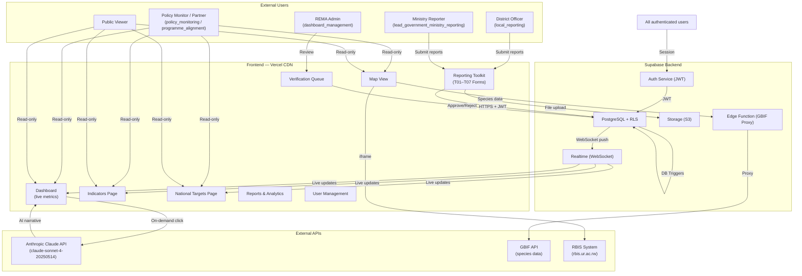
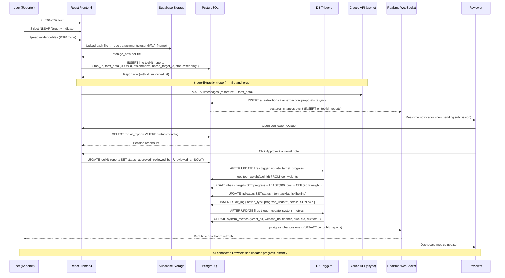
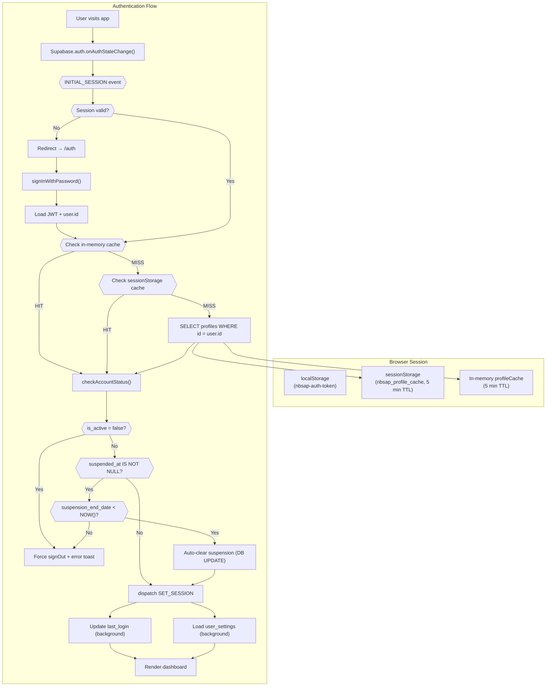
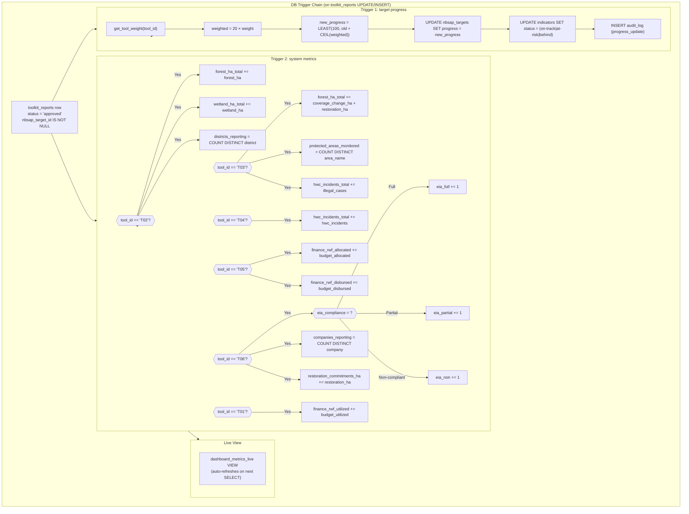
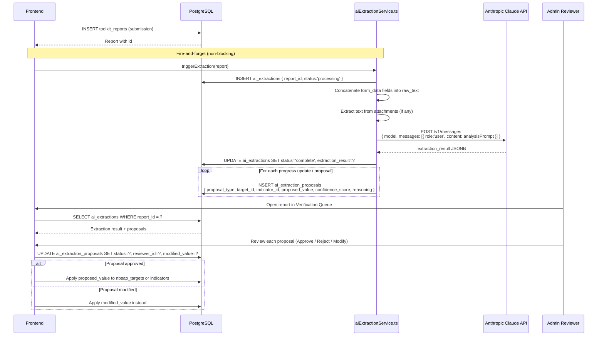
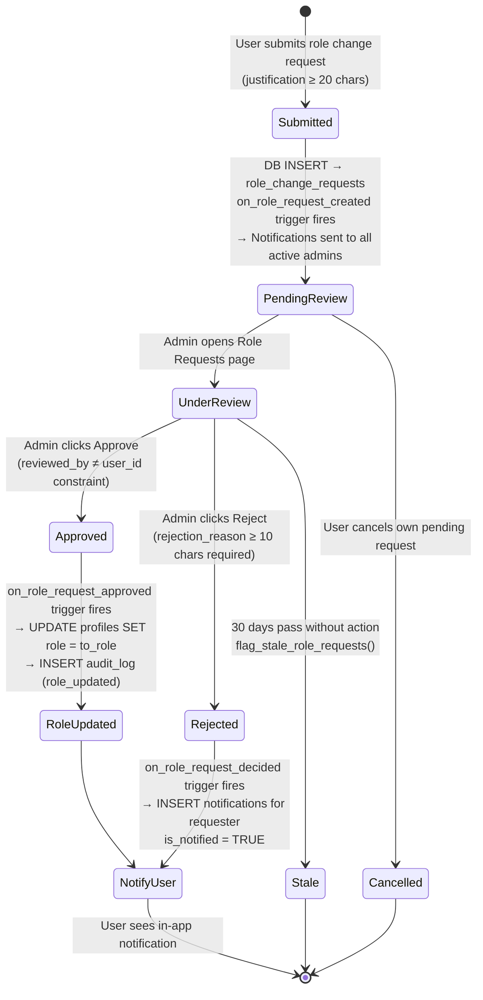
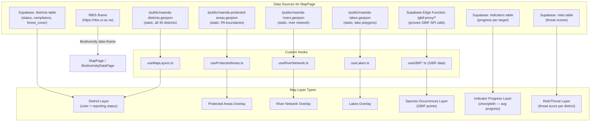
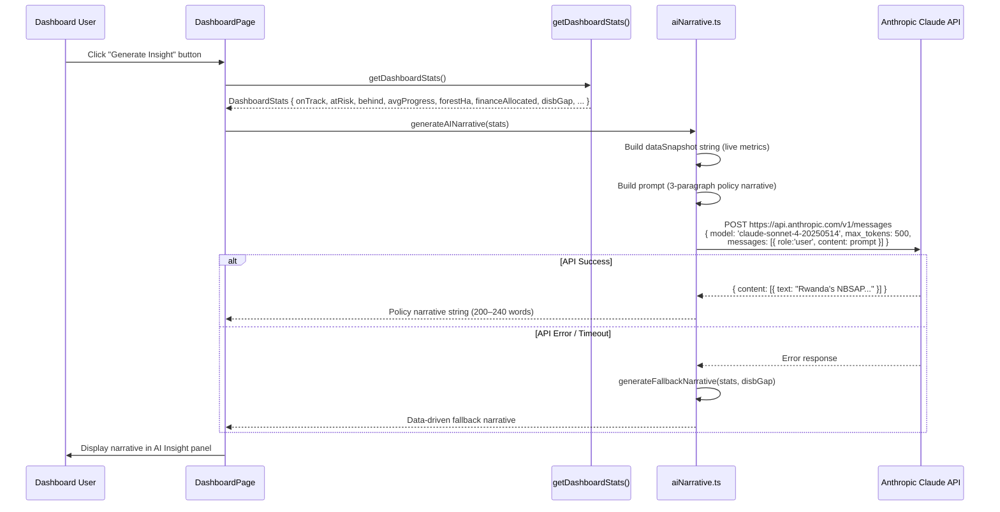

# DATA FLOW DIAGRAMS
## Rwanda NBSAP Monitoring Dashboard

---

## 1. System-Level Data Flow Overview



---

## 2. Report Submission Flow (Detailed)



---

## 3. Authentication & Session Flow



---

## 4. Automated Metrics Update Flow



---

## 5. Delete Reversal Flow

```mermaid
sequenceDiagram
    participant Admin as REMA Admin
    participant FE as Frontend
    participant DB as PostgreSQL
    participant Trigger as DB Triggers
    participant EventBus as eventBus

    Admin->>FE: Click Delete Report
    FE->>DB: SELECT report (tool_id, status, target_id, period)
    DB-->>FE: Report metadata

    FE->>DB: DELETE FROM toolkit_reports WHERE id = ?
    
    DB->>Trigger: AFTER DELETE — trigger_update_target_progress fires
    Note over Trigger: Status is no longer 'approved' → progress DECREMENTS
    Trigger->>DB: Recalculate nbsap_targets.progress (subtract contribution)
    Trigger->>DB: Recalculate indicators.status

    DB->>Trigger: AFTER DELETE — trigger_update_system_metrics fires
    Trigger->>DB: Recalculate all affected system_metrics FROM SCRATCH
    Note over Trigger: recalculate_system_metrics() rebuilds from all remaining approved reports

    FE->>DB: INSERT audit_log { action_type:'delete', detail: report metadata }

    FE->>EventBus: emit('dashboard-refresh', {})
    FE->>EventBus: emit('target-progress-updated', { targetId })
    EventBus-->>FE: All subscribed dashboard components re-fetch data

    Note over Admin,FE: Dashboard metrics auto-reverse; no manual correction needed
```

---

## 6. AI Extraction Flow



---

## 7. Role Change Workflow



---

## 8. Real-time Data Subscription Flow

```mermaid
flowchart LR
    subgraph DB["PostgreSQL (Supabase)"]
        TR["toolkit_reports"]
        NOTIF["notifications"]
    end

    subgraph Realtime["Supabase Realtime Engine"]
        WS["WebSocket Server<br/>(wss://*.supabase.co)"]
        CH1["Channel: toolkit_reports_changes:{random}<br/>Event: * (INSERT|UPDATE|DELETE)"]
        CH2["Channel: notifications:{userId}<br/>Event: INSERT<br/>Filter: user_id=eq.{id}"]
    end

    subgraph FE["React Frontend Components"]
        DashComp["DashboardPage<br/>→ refresh stats on any event"]
        RepComp["ReportsPage<br/>→ refresh list on any event"]
        NotifBell["Notification Bell<br/>→ show new notification"]
    end

    TR -->|WAL (Write-Ahead Log)| WS
    NOTIF -->|WAL| WS
    WS --> CH1 --> DashComp & RepComp
    WS --> CH2 --> NotifBell

    Note1["Rate limit: 10 events/second<br/>Channel is random per session to<br/>prevent duplicate subscriptions"]
```

---

## 9. Map Data Flow



---

## 10. Dashboard Stats Calculation Flow

```mermaid
flowchart TD
    subgraph Cache["Stats Cache (60s TTL)"]
        StatsCache["_statsCache<br/>{ data, ts }"]
    end

    subgraph Fetch["getDashboardStats() — Promise.all"]
        Q1["SELECT tool_id, status, form_data FROM toolkit_reports"]
        Q2["SELECT status, progress, tier FROM indicators"]
        Q3["SELECT status, compliance FROM districts"]
        Q4["SELECT id FROM compliance_records WHERE is_resolved=false"]
        Q5["SELECT id FROM nbsap_targets (COUNT)"]
    end

    subgraph Calc["buildStats() Calculations"]
        C1["totalSubmissions = reports.length"]
        C2["pendingVerifications = filter(status='pending').length"]
        C3["reportsByTool = group by tool_id"]
        C4["forestHa = SUM T02.approved.form_data.forest_ha"]
        C5["wetlandHa = SUM T02.approved.form_data.wetland_ha"]
        C6["hwcIncidents = SUM T04.approved.form_data.hwc_incidents"]
        C7["financeAllocated = SUM T05.approved.form_data.budget_allocated"]
        C8["financeDisbursed = SUM T05.approved.form_data.budget_disbursed"]
        C9["onTrack/atRisk/behind = filter by indicator.status"]
        C10["avgProgress = SUM(progress) / count"]
        C11["activeDistricts = '{submitted}/{total}'"]
        C12["headlineCount = filter(tier='headline').length"]
    end

    subgraph Output["DashboardStats object"]
        O1["Passed to metric cards, charts, AI narrative"]
    end

    StatsCache -->|HIT (< 60s)| O1
    StatsCache -->|MISS| Fetch
    Q1 & Q2 & Q3 & Q4 & Q5 --> Calc
    Calc --> C1 & C2 & C3 & C4 & C5 & C6 & C7 & C8 & C9 & C10 & C11 & C12
    C1 & C2 & C3 & C4 & C5 & C6 & C7 & C8 & C9 & C10 & C11 & C12 --> O1
    O1 --> StatsCache
```

---

## 11. AI Narrative Generation Flow



---

*Document version: 2026-06-17 | Rwanda NBSAP Monitoring Dashboard v1.0.0*
