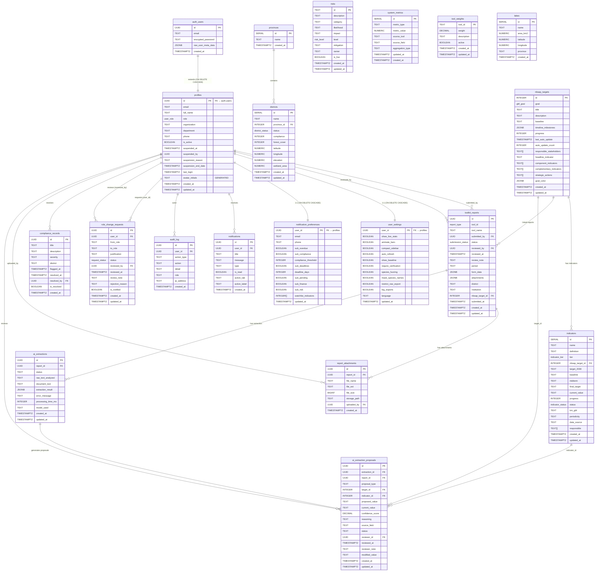
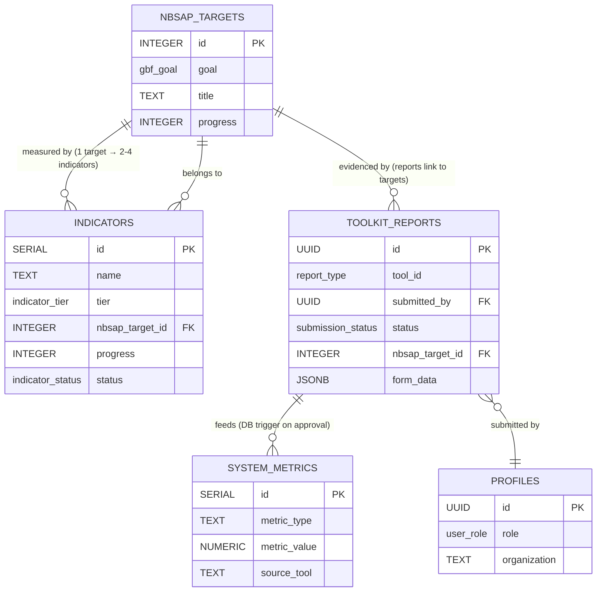
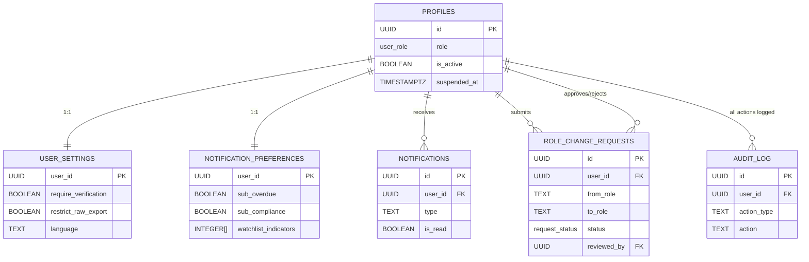
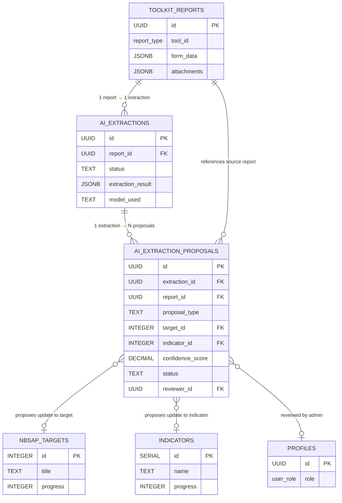
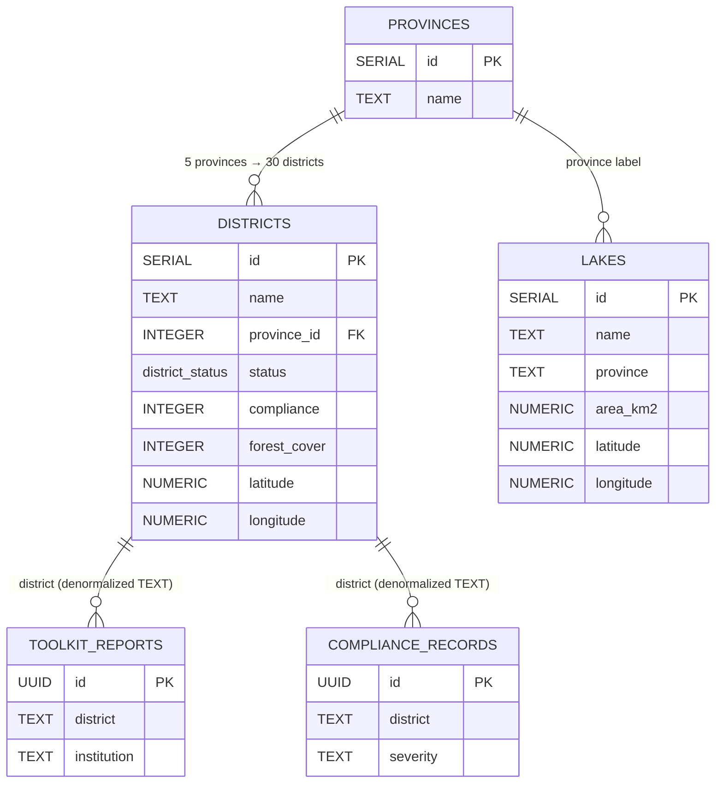
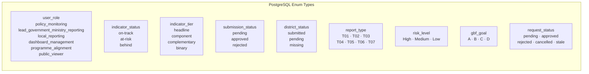

# ENTITY RELATIONSHIP DIAGRAM
## Rwanda NBSAP Monitoring Dashboard

---

## 1. Complete Entity Relationship Diagram

---

## 2. Core Domain Relationships

---

## 3. User & Access Control Relationships

---

## 4. AI Layer Relationships

---

## 5. Geography Relationships

---

## 6. Key Cardinalities Summary

| Relationship | Cardinality | Notes |
|---|---|---|
| auth.users → profiles | 1:1 | Auto-created on signup via trigger |
| profiles → user_settings | 1:1 | Auto-created on signup |
| profiles → notification_preferences | 1:1 | Auto-created on signup |
| provinces → districts | 1:N | 5 provinces, 30 districts |
| nbsap_targets → indicators | 1:N | 1 target → 2–4 component indicators + 1 headline |
| nbsap_targets → toolkit_reports | 1:N | Each report optionally links to 1 target |
| toolkit_reports → report_attachments | 1:N | Attachment metadata also stored in JSONB |
| toolkit_reports → ai_extractions | 1:1 | One AI extraction per report |
| ai_extractions → ai_extraction_proposals | 1:N | Multiple proposals per extraction |
| profiles → toolkit_reports (submitted) | 1:N | User can submit many reports |
| profiles → toolkit_reports (reviewed) | 1:N | Admin can review many reports |
| profiles → role_change_requests | 1:N | User can have multiple role requests (over time) |
| profiles → audit_log | 1:N | Every user action is logged |
| profiles → notifications | 1:N | Each user can have many notifications |

---

## 7. Enum Reference

---

*Document version: 2026-06-17 | Rwanda NBSAP Monitoring Dashboard v1.0.0*
