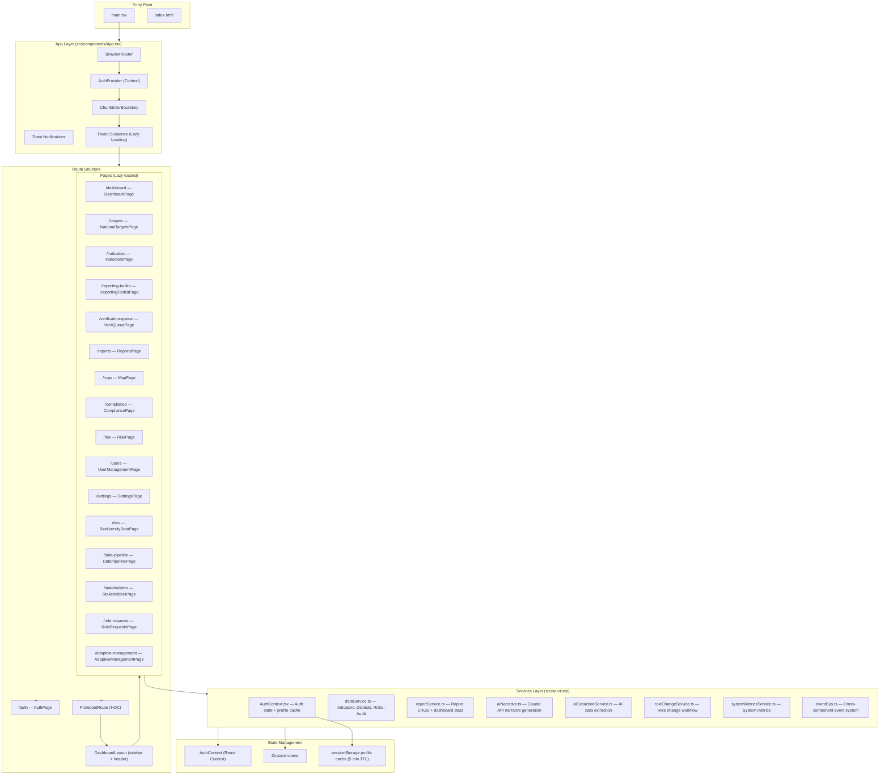
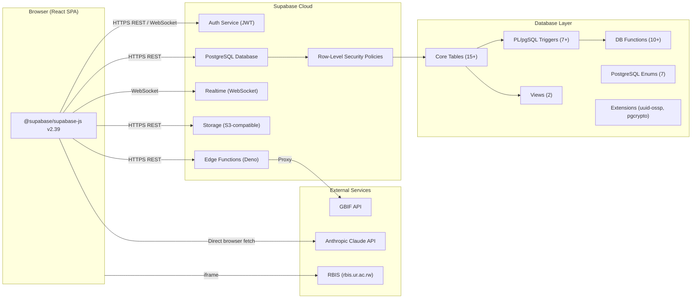
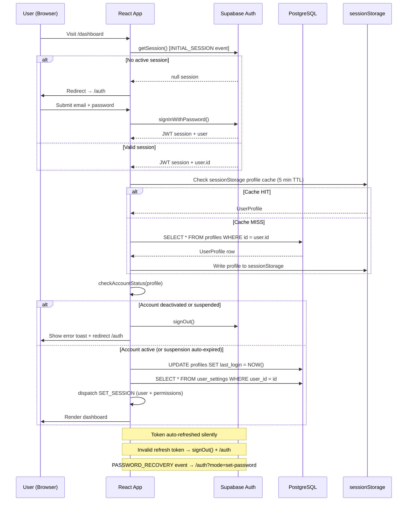
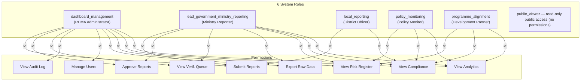
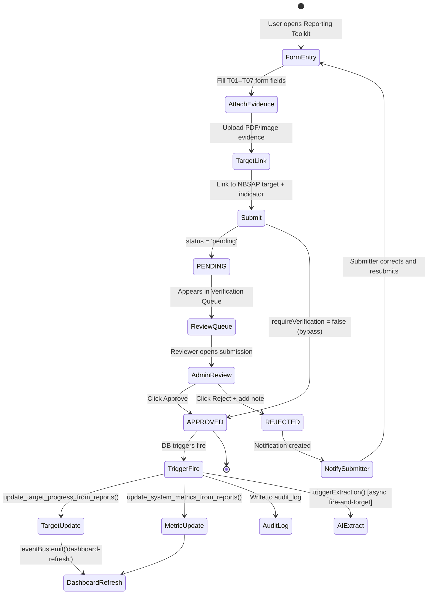
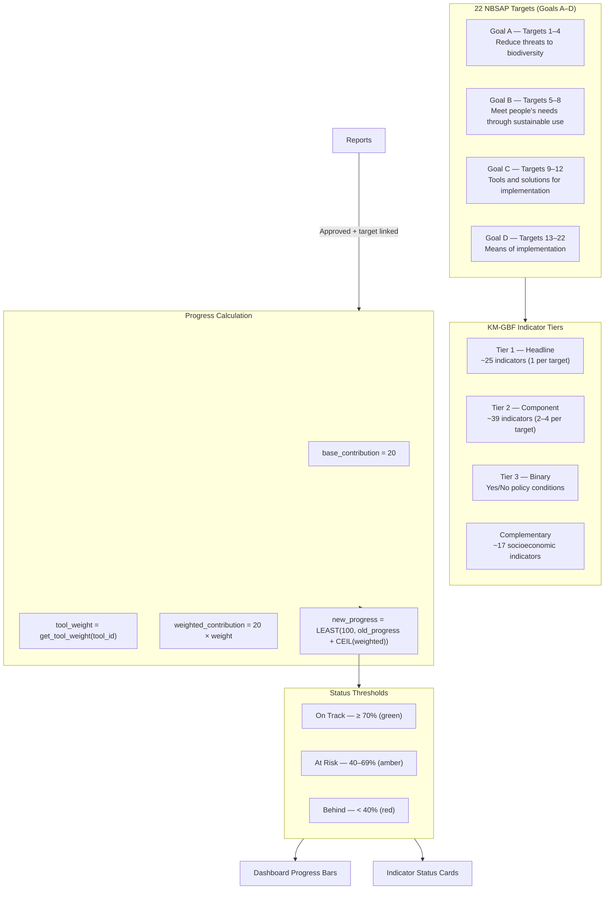
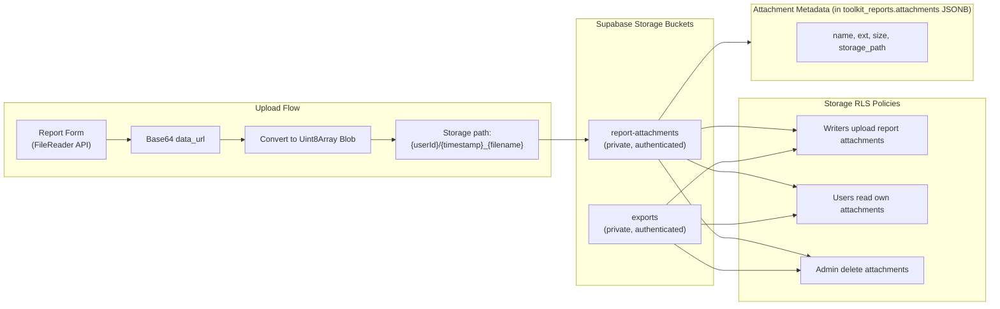
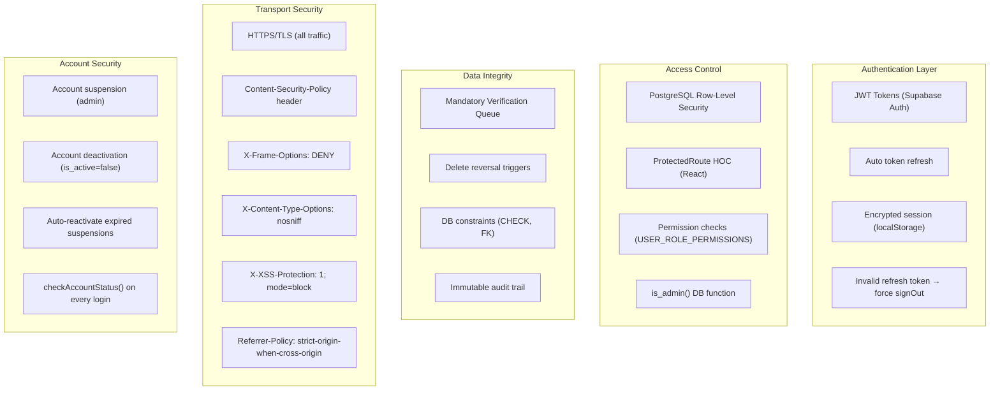
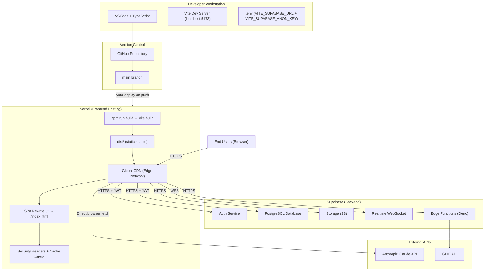

# SYSTEM ARCHITECTURE
## Rwanda NBSAP Monitoring Dashboard — 2025–2030

---

## 1. System Overview

The **Rwanda NBSAP Monitoring Dashboard** is a national digital platform for tracking, reporting, verifying, and visualising Rwanda's progress across 22 national biodiversity targets under the **National Biodiversity Strategy and Action Plan (NBSAP) 2025–2030**, aligned with the **Kunming-Montreal Global Biodiversity Framework (KM-GBF)**.

| Attribute | Value |
|---|---|
| **Live URL** | https://nbsap-dashboard-rw.vercel.app |
| **Architecture** | Single-Page Application (SPA) + Backend-as-a-Service (BaaS) |
| **Database** | Supabase PostgreSQL (cloud-hosted) |
| **Frontend Hosting** | Vercel (global CDN) |
| **AI Integration** | Anthropic Claude API (`claude-sonnet-4-20250514`) |
| **External Data** | GBIF API, RBIS (University of Rwanda) |
| **Coverage** | 22 NBSAP targets · 30 Rwanda districts · 5 roles |

---

## 2. Technology Stack

### Frontend
| Technology | Version | Purpose |
|---|---|---|
| React | 18.2.0 | UI framework |
| TypeScript | 5.2.2 | Type safety |
| Vite | 5.0.8 | Build tool & dev server |
| React Router DOM | 6.21.0 | Client-side routing |
| Zustand | 4.4.7 | Global state management |
| Chart.js + react-chartjs-2 | 4.4.1 / 5.2.0 | Data visualisation |
| Lucide React | 0.263.1 | Icon system |
| react-hot-toast | 2.4.1 | Toast notifications |
| clsx | 2.1.0 | Conditional className utility |
| date-fns | 3.0.6 | Date formatting |
| jsPDF | 4.2.1 | PDF export |
| pptxgenjs | 4.0.1 | PowerPoint export |
| @fortawesome/fontawesome-free | 7.2.0 | Icon library |

### Backend (Supabase BaaS)
| Component | Technology | Purpose |
|---|---|---|
| Database | PostgreSQL (via Supabase) | Persistent data storage |
| Auth | Supabase Auth (JWT) | User authentication & session management |
| Row-Level Security | PostgreSQL RLS | Data isolation per role |
| Realtime | Supabase Realtime (WebSocket) | Live dashboard updates |
| Storage | Supabase Storage | Evidence file uploads |
| Edge Functions | Deno / TypeScript | GBIF API proxy |
| DB Triggers | PL/pgSQL | Automated metrics & progress updates |
| DB Functions | PL/pgSQL | Business logic (weights, metrics) |

### External Integrations
| Service | Usage |
|---|---|
| Anthropic Claude API | AI progress narratives + AI data extraction from reports |
| GBIF API | Global species occurrence data (via edge function proxy) |
| RBIS (rbis.ur.ac.rw) | Rwanda Biodiversity Information System (embedded iframe) |
| Vercel | Frontend hosting, CDN, CI/CD |

### Development Tools
| Tool | Version | Purpose |
|---|---|---|
| ESLint | 8.55.0 | Code linting |
| Vitest | 4.1.8 | Unit testing |
| @testing-library/react | 16.3.2 | Component testing |
| TypeScript ESLint | 6.14.0 | TypeScript linting |

---

## 3. Frontend Architecture



### Component Hierarchy
```
src/
├── components/
│   ├── App.tsx                    # Root: Router + AuthProvider + Toaster
│   ├── AuthPage.tsx               # Login / signup / password reset
│   ├── DashboardLayout.tsx        # Persistent sidebar + topbar shell
│   ├── ProtectedRoute.tsx         # Role + permission guard HOC
│   ├── ErrorBoundary.tsx          # Global error boundary
│   ├── NBSAPTargetProgress.tsx    # Dashboard target progress widget
│   ├── PendingRequestsBadge.tsx   # Admin notification badge
│   ├── RoleChange*.tsx            # Role change request components (3)
│   ├── Skeleton.tsx               # Loading skeleton components
│   ├── common/                    # Shared UI primitives
│   ├── map/                       # Map layer components (Leaflet/canvas)
│   ├── panels/                    # Dashboard metric panels
│   └── rbis/                      # RBIS/biodiversity-specific components
├── pages/                         # Page-level containers (route targets)
├── hooks/                         # Custom React hooks
├── services/                      # API + business logic
├── types/                         # TypeScript type definitions
└── utils/                         # Pure utility functions
```

### State Architecture
- **AuthContext** — User profile, JWT session, role permissions (React Context + useReducer)
- **Zustand** — Shared data stores (indicators, targets, reports)
- **sessionStorage cache** — Profile cache with 5-minute TTL to avoid redundant DB fetches on page refresh
- **In-memory stats cache** — `_statsCache` in `reportService.ts` with 60-second TTL for dashboard aggregates

---

## 4. Backend Architecture

The backend is **serverless via Supabase** (no traditional API server). All data operations use the Supabase JS client with RLS-enforced direct table access.



### Database Trigger Chain (on report approval)
```
toolkit_reports UPDATE (status → 'approved')
    │
    ├── trigger_update_target_progress
    │       └── update_target_progress_from_reports()
    │               ├── Reads tool weight from tool_weights table
    │               ├── Calculates weighted_contribution = 20 × tool_weight
    │               ├── Updates nbsap_targets.progress (capped at 100)
    │               ├── Updates related indicators.status
    │               └── Writes to audit_log (progress_update event)
    │
    └── trigger_update_system_metrics
            └── update_system_metrics_from_reports()
                    ├── T02 → forest_ha_total, wetland_ha_total
                    ├── T03 → forest_ha_total, restoration_commitments_ha
                    ├── T04 → hwc_incidents_total
                    ├── T05 → finance_rwf_allocated, finance_rwf_disbursed
                    ├── T06 → eia_compliance_*, companies_reporting
                    └── T02 → districts_reporting (COUNT DISTINCT)
```

---

## 5. Authentication Flow



### Session Lifecycle
| Event | Action |
|---|---|
| `INITIAL_SESSION` | Resolve startup auth state; load profile; check account status |
| `SIGNED_IN` | Load user profile; set permissions; update last_login |
| `SIGNED_OUT` | Clear cache + state; redirect to /auth |
| `TOKEN_REFRESHED` | Silent — session remains valid |
| `USER_UPDATED` | Invalidate cache; reload profile |
| `PASSWORD_RECOVERY` | Redirect to /auth?mode=set-password |
| Refresh token 400 | Custom event → force signOut |

---

## 6. User Roles & Permissions



### Route Access Matrix
| Route | DM | LG | LR | PM | PA | PV |
|---|:---:|:---:|:---:|:---:|:---:|:---:|
| /dashboard | ✅ | ✅ | ✅ | ✅ | ✅ | ✅ |
| /indicators | ✅ | ✅ | ✅ | ✅ | ✅ | ✅ |
| /targets | ✅ | ✅ | ✅ | ✅ | ✅ | ✅ |
| /map | ✅ | ✅ | ✅ | ✅ | ✅ | ✅ |
| /reports | ✅ | ✅ | ✅ | ✅ | ✅ | ✅ |
| /compliance | ✅ | ✅ | ✅ | ✅ | ✅ | ❌ |
| /reporting-toolkit | ✅ | ✅ | ✅ | ❌ | ❌ | ❌ |
| /verification-queue | ✅ | ✅ | ❌ | ❌ | ❌ | ❌ |
| /risk | ✅ | ✅ | ❌ | ✅ | ✅ | ❌ |
| /users | ✅ | ❌ | ❌ | ❌ | ❌ | ❌ |
| /role-requests/admin | ✅ | ❌ | ❌ | ❌ | ❌ | ❌ |

---

## 7. Reporting Workflow



### 7 Reporting Tools
| Tool | Name | Key Fields |
|---|---|---|
| T01 | National Institutional Reporting | institution, budget_utilized, compliance_score, nbsap_target |
| T02 | Ecosystem & Habitat Monitoring | district, forest_ha, wetland_ha, land_cover_change |
| T03 | Protected Area Management | area_name, coverage_ha, management_effectiveness, illegal_cases, restoration_ha |
| T04 | Human-Wildlife Conflict Monitoring | incident_type, district, species, hwc_incidents |
| T05 | Finance & Resource Mobilisation | budget_allocated, budget_disbursed, finance_source |
| T06 | Private Sector EIA Compliance | company, eia_compliance, sector, restoration_ha |
| T07 | Community Engagement & Social Inclusion | community_name, district, participant_count, traditional_knowledge |

### Tool Weights (for progress calculation)
Each tool contributes a weighted share of 20 base progress points to linked NBSAP targets. Weights are stored in the `tool_weights` table and fetched at submission time.

---

## 8. NBSAP Target Management



---

## 9. Analytics & Dashboards

### Dashboard Components
| Component | Data Source | Update Mechanism |
|---|---|---|
| Metric Cards (4) | `getDashboardStats()` | 60s cache + realtime subscription |
| Indicator Progress Trends | `indicators` table | Supabase realtime |
| NBSAP Target Progress Widget | `nbsap_targets` view | DB trigger → realtime |
| Automated System Metrics | `dashboard_metrics_live` view | DB trigger on report approval |
| Recent Activity Feed | `toolkit_reports` table | Realtime subscription |
| AI Progress Narrative | Anthropic Claude API | On-demand (user clicks "Generate Insight") |

### Reports Page Analytics Tabs
- **Overview** — KPI cards (total, pending, approved, progress%)
- **Progress Analysis** — Target-by-target progress charts
- **Compliance** — Tool-by-tool compliance rates
- **Submitter Analytics** — Per-user/institution submission stats
- **Timeline** — Chronological submission feed

### Export Formats
| Format | Function | Contents |
|---|---|---|
| CSV | `exportReportsToCSV()` | Flattened report data with form fields |
| JSON | `exportReportsToJSON()` | Full structured report objects |
| PDF | `jsPDF` | Formatted national progress report |
| PowerPoint | `pptxgenjs` | Presentation-ready slides |

---

## 10. File Storage Architecture



### Supported File Types
- PDF documents
- Images (JPEG, PNG)
- Reports and monitoring documents
- GPS/field data exports

---

## 11. API Endpoints

The system uses **Supabase PostgREST** (REST auto-generated from PostgreSQL schema) and the **Supabase JS client** — there is no custom REST API server.

### Supabase Table Operations
| Operation | Table | Description |
|---|---|---|
| SELECT | `profiles` | Fetch user profile (own or admin) |
| SELECT | `indicators` | List indicators with tier/target/status filters |
| SELECT | `nbsap_targets` | Fetch targets with linked indicators |
| SELECT | `toolkit_reports` | Fetch reports with profile join + pagination |
| INSERT | `toolkit_reports` | Submit new report |
| UPDATE | `toolkit_reports` | Approve/reject report (status change) |
| DELETE | `toolkit_reports` | Admin delete (triggers reversal) |
| SELECT | `districts` | List all 30 Rwanda districts |
| SELECT | `risks` | Risk register with filters |
| SELECT/INSERT | `audit_log` | Read audit history / write audit event |
| SELECT/UPSERT | `user_settings` | Read/save user preferences |
| SELECT/UPSERT | `notification_preferences` | Notification settings |
| SELECT | `system_metrics` | Live system metric values |
| SELECT | `dashboard_metrics_live` | Aggregated dashboard view |
| SELECT/INSERT | `role_change_requests` | Submit/review role requests |
| SELECT | `ai_extractions` | AI extraction results |
| SELECT/UPDATE | `ai_extraction_proposals` | Review AI proposals |

### Supabase RPC Functions
| Function | Purpose |
|---|---|
| `get_system_metrics()` | Returns all system metrics in structured format |
| `recalculate_system_metrics()` | Admin: full metric recalculation from scratch |
| `get_user_responsible_targets(user_org)` | Returns targets linked to a user's organisation |
| `flag_stale_role_requests()` | Mark 30-day-old pending requests as stale |

### External API Calls
| API | Endpoint | Usage |
|---|---|---|
| Anthropic Claude | `https://api.anthropic.com/v1/messages` | AI narrative generation + data extraction |
| GBIF (via Edge Fn) | `/functions/v1/gbif-proxy/*` | Species occurrence data proxy |
| RBIS | `https://rbis.ur.ac.rw` | Biodiversity data (embedded iframe) |

### Realtime Subscriptions
| Channel | Table | Filter | Consumer |
|---|---|---|---|
| `toolkit_reports_changes:{random}` | toolkit_reports | all events | Dashboard, reports page |
| `notifications:{userId}` | notifications | `user_id=eq.{id}` | Notification bell |

---

## 12. Security Controls



### RLS Policy Summary
| Table | Policy |
|---|---|
| `profiles` | Users see own; admins see all |
| `toolkit_reports` | Admin/policy/partner: all; sector: all; local: own submissions only |
| `indicators` | All authenticated: read; writers: update; admin: insert |
| `nbsap_targets` | All authenticated: read; admin: all |
| `audit_log` | Users: own entries; admin: all entries |
| `notifications` | Users: own notifications only |
| `user_settings` | Users: own settings only |
| `role_change_requests` | Users: own requests; admin: all (no self-approval) |

### Content Security Policy (from vercel.json)
```
default-src 'self'
connect-src 'self' *.supabase.co wss://*.supabase.co api.anthropic.com api.gbif.org *.geoboundaries.org
frame-src https://rbis.ur.ac.rw
```

---

## 13. Audit Trail Mechanisms

Every significant action in the system writes to `audit_log`:

| action_type | Trigger | Details |
|---|---|---|
| `submit` | Report submission | tool_id, period, target_id |
| `approve` | Report approval | report_id, reviewer, timestamp |
| `reject` | Report rejection | report_id, reviewer, reason |
| `delete` | Report deletion | tool_id, status, period, target |
| `role_updated` | Role change approved | from_role, to_role, reviewer |
| `auto_reactivate_account` | Suspension expiry | expiry date |
| `progress_update` | DB trigger fires | tool_weight, contribution, before/after progress |
| `map_action` | Map layer/overlay/export | eventType, metadata JSON |
| `export` | Data export | format, record count |
| `login` / `logout` | Session events | user, role |

The audit log is **append-only** with no DELETE policy, ensuring a complete, tamper-evident record.

---

## 14. Performance Considerations

| Technique | Implementation | Impact |
|---|---|---|
| **Code splitting** | React.lazy + Suspense on all pages | Reduces initial bundle; pages load on demand |
| **Profile cache** | In-memory + sessionStorage (5 min TTL) | Eliminates DB round-trips on page refresh |
| **Stats cache** | `_statsCache` in reportService (60s TTL) | Reduces dashboard aggregate queries |
| **DB indexes** | 15+ indexes on frequently filtered columns | Fast queries on status, tool_id, user_id, dates |
| **GIN index** | `form_data` JSONB GIN index | Fast JSONB field searches in metrics recalc |
| **Pagination** | All list queries: `.range(from, to)` | Never loads unbounded result sets |
| **Parallel queries** | `Promise.all()` for dashboard stats | Reduces waterfall; 5 queries in parallel |
| **Realtime (WS)** | `eventsPerSecond: 10` rate limit | Prevents event flooding |
| **Immutable asset caching** | `Cache-Control: max-age=31536000, immutable` on /assets/ | CDN-cached forever; instant repeat loads |
| **No-cache HTML** | `no-cache, no-store` on index.html | Always fetches latest deployment |
| **Stale chunk recovery** | `ChunkErrorBoundary` → `window.location.reload()` | Auto-recovers from outdated cached chunks |
| **Lazy image/geo loading** | GeoJSON files fetched on map page entry | Geographic data only loaded when needed |

---

## 15. Folder Structure

```
NBSAP FRONT AND BACKEND/
├── src/
│   ├── components/           # React components (shared + layout)
│   │   ├── common/           # Reusable UI primitives
│   │   ├── map/              # Map layer / overlay components
│   │   ├── panels/           # Dashboard metric panels
│   │   └── rbis/             # RBIS-specific components
│   ├── hooks/                # Custom React hooks (data fetching)
│   ├── pages/                # Route-level page components
│   ├── services/             # API services + business logic
│   ├── types/                # TypeScript interfaces + enums
│   └── utils/                # Pure utility functions + supabase client
├── migrations/               # PostgreSQL migration files (001–021)
├── docs/                     # Project documentation
├── public/                   # Static GeoJSON files + favicon
│   ├── rwanda-districts.geojson
│   ├── rwanda-protected-areas.geojson
│   ├── rwanda-rivers.geojson
│   └── rwanda-lakes.geojson
├── supabase/
│   ├── functions/            # Edge functions (GBIF proxy)
│   └── config.toml           # Supabase project config
├── .kiro/specs/              # Kiro AI project specifications
├── main.tsx                  # Vite entry point
├── index.html                # HTML shell
├── package.json              # Dependencies
├── tsconfig.json             # TypeScript config
├── vite.config.ts            # Vite build config
├── vercel.json               # Vercel deployment config (headers + rewrites)
├── .env                      # Environment variables (not committed)
└── .env.example              # Environment variable template
```

---

## 16. Deployment Architecture



### Environment Variables
| Variable | Purpose | Required |
|---|---|---|
| `VITE_SUPABASE_URL` | Supabase project REST endpoint | Yes |
| `VITE_SUPABASE_ANON_KEY` | Supabase public anon key (JWT-enforced by RLS) | Yes |

> Note: The Anthropic API key is embedded in the aiNarrative service and uses the `anthropic-dangerous-direct-browser-access: true` header for direct browser-to-API calls. In production this should be moved to a Supabase Edge Function to protect the key.

### Build Configuration
```json
{
  "framework": "vite",
  "buildCommand": "npm run build",
  "outputDirectory": "dist",
  "rewrites": [{ "source": "/(.*)", "destination": "/index.html" }]
}
```

---

*Document version: 2026-06-17 | System: Rwanda NBSAP Monitoring Dashboard v1.0.0*
