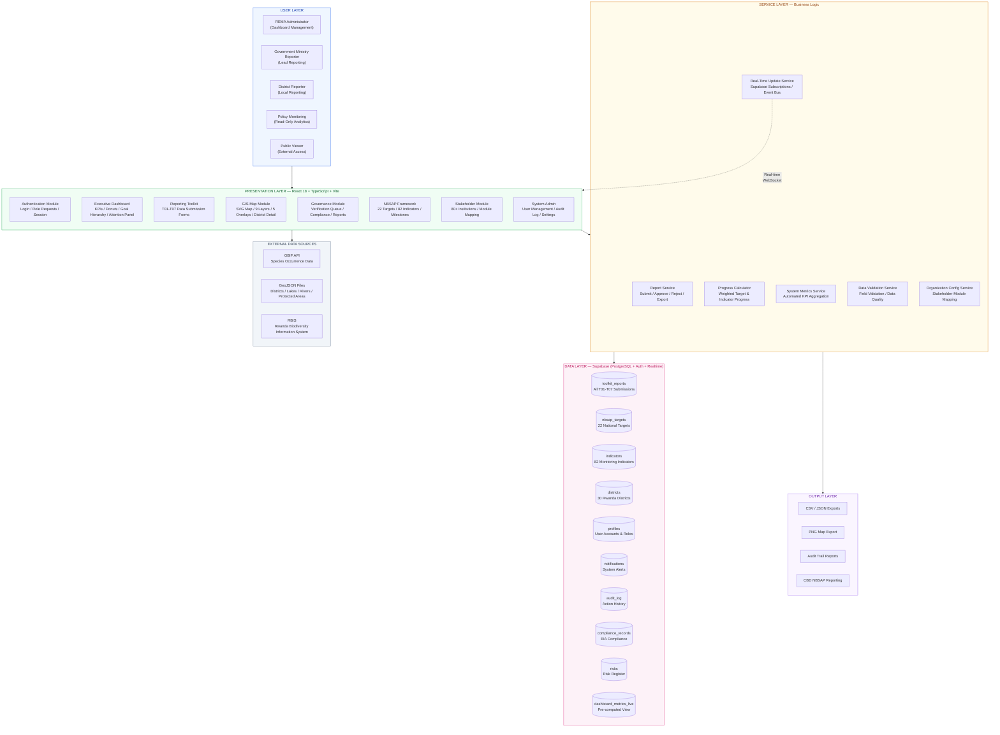

# NBSAP Monitoring System — High-Level Architecture Diagram

Copy the Mermaid code below into https://mermaid.live or any Mermaid-compatible tool to generate the diagram image, then paste into your Word document.

---

---

## Architecture Summary

| Layer | Technology | Purpose |
|-------|-----------|---------|
| Presentation | React 18, TypeScript, Vite, Chart.js | User interface, dashboards, maps, forms |
| Service | Custom hooks, Event Bus, Zustand | Business logic, progress calculation, real-time sync |
| Data | Supabase (PostgreSQL), Row Level Security | Persistent storage, authentication, real-time subscriptions |
| External | GBIF API, GeoJSON, RBIS | Biodiversity species data, geographic boundaries |
| Output | CSV, JSON, PNG | Data exports, reporting, CBD compliance |

## Key Integration Points

1. **Supabase Real-Time** — WebSocket subscriptions push target progress updates to all connected clients instantly
2. **GBIF API** — Species occurrence data fetched and cached, feeds biodiversity index calculation per district
3. **GeoJSON** — Rwanda district boundaries, lakes, rivers, protected areas loaded from static files
4. **Event Bus** — Internal pub/sub system propagates report approvals → target progress → dashboard refresh
5. **Deterministic Progress Engine** — PostgreSQL functions (`compute_target_progress`, `compute_indicator_progress`) auto-calculate progress from approved reports
