```mermaid
graph LR
    subgraph ACTORS["SYSTEM ACTORS"]
        A1(("REMA Administrator<br/>(dashboard_management)"))
        A2(("Government Ministry<br/>Reporter<br/>(lead_government_<br/>ministry_reporting)"))
        A3(("District Reporter<br/>(local_reporting)"))
        A4(("Policy Monitor<br/>(policy_monitoring)"))
        A5(("Public Viewer<br/>(public_viewer)"))
    end

    subgraph UC_AUTH["Authentication"]
        UC1["Login / Logout"]
        UC2["Request Role Change"]
    end

    subgraph UC_VIEW["View & Explore"]
        UC3["View Dashboard"]
        UC4["View National Targets"]
        UC5["View Indicators"]
        UC6["View GIS Map"]
        UC7["View Reports"]
        UC8["View Stakeholders"]
    end

    subgraph UC_REPORT["Data Submission"]
        UC9["Submit T01 Institutional Report"]
        UC10["Submit T02 District Monitoring"]
        UC11["Submit T03 Protected Area Report"]
        UC12["Submit T04 Community Report"]
        UC13["Submit T05 Finance Report"]
        UC14["Submit T06 Private Sector Report"]
        UC15["Submit T07 Research Report"]
    end

    subgraph UC_GOV["Governance"]
        UC16["Review & Approve Reports"]
        UC17["View Verification Queue"]
        UC18["View Compliance"]
        UC19["View Risk Register"]
        UC20["View Adaptive Management"]
    end

    subgraph UC_ADMIN["Administration"]
        UC21["Manage Users"]
        UC22["View Audit Log"]
        UC23["Approve Role Requests"]
        UC24["Manage Settings"]
        UC25["Export Data (CSV/JSON/PNG)"]
    end

    %% All users
    A1 --> UC1
    A2 --> UC1
    A3 --> UC1
    A4 --> UC1
    A5 --> UC1

    A1 --> UC2
    A2 --> UC2
    A3 --> UC2
    A4 --> UC2

    %% View — all roles
    A1 --> UC3
    A2 --> UC3
    A3 --> UC3
    A4 --> UC3
    A5 --> UC3

    A1 --> UC4
    A2 --> UC4
    A3 --> UC4
    A4 --> UC4
    A5 --> UC4

    A1 --> UC5
    A2 --> UC5
    A3 --> UC5
    A4 --> UC5
    A5 --> UC5

    A1 --> UC6
    A2 --> UC6
    A3 --> UC6
    A4 --> UC6
    A5 --> UC6

    A1 --> UC7
    A2 --> UC7
    A3 --> UC7
    A4 --> UC7
    A5 --> UC7

    A1 --> UC8
    A2 --> UC8
    A3 --> UC8
    A4 --> UC8
    A5 --> UC8

    %% Reporting — admin, lead gov, local
    A1 --> UC9
    A1 --> UC10
    A1 --> UC11
    A1 --> UC12
    A1 --> UC13
    A1 --> UC14
    A1 --> UC15

    A2 --> UC9
    A2 --> UC10
    A2 --> UC11
    A2 --> UC12
    A2 --> UC13
    A2 --> UC14
    A2 --> UC15

    A3 --> UC9
    A3 --> UC10
    A3 --> UC12

    %% Governance — admin, lead gov
    A1 --> UC16
    A1 --> UC17
    A2 --> UC16
    A2 --> UC17

    A1 --> UC18
    A2 --> UC18
    A3 --> UC18
    A4 --> UC18

    A1 --> UC19
    A2 --> UC19
    A4 --> UC19

    A1 --> UC20
    A2 --> UC20
    A4 --> UC20

    %% Admin — dashboard_management only
    A1 --> UC21
    A1 --> UC22
    A1 --> UC23
    A1 --> UC24
    A1 --> UC25
    A2 --> UC25

    style ACTORS fill:#eff6ff,stroke:#2563eb
    style UC_AUTH fill:#f1f5f9,stroke:#64748b
    style UC_VIEW fill:#f0fdf4,stroke:#16a34a
    style UC_REPORT fill:#fffbeb,stroke:#d97706
    style UC_GOV fill:#fdf2f8,stroke:#db2777
    style UC_ADMIN fill:#faf5ff,stroke:#7c3aed
```

# NBSAP Monitoring System — Use Case Diagram

Copy the Mermaid code below into https://mermaid.live to generate the diagram image, then paste into your Word document.

---

---

## User Roles & Permissions Matrix

| Permission | REMA Admin | Gov Ministry Reporter | District Reporter | Policy Monitor | Public Viewer |
|-----------|:---:|:---:|:---:|:---:|:---:|
| View Dashboard | Yes | Yes | Yes | Yes | Yes |
| View Targets / Indicators | Yes | Yes | Yes | Yes | Yes |
| View GIS Map | Yes | Yes | Yes | Yes | Yes |
| View Reports | Yes | Yes | Yes | Yes | Yes |
| View Stakeholders | Yes | Yes | Yes | Yes | Yes |
| Submit Reports (T01-T07) | Yes | Yes | Yes (T01,T02,T04) | No | No |
| Approve/Reject Reports | Yes | Yes | No | No | No |
| View Verification Queue | Yes | Yes | No | No | No |
| View Compliance | Yes | Yes | Yes | Yes | No |
| View Risk Register | Yes | Yes | No | Yes | No |
| View Adaptive Management | Yes | Yes | No | Yes | No |
| Manage Users | Yes | No | No | No | No |
| View Audit Log | Yes | No | No | No | No |
| Approve Role Requests | Yes | No | No | No | No |
| Export Data (CSV/JSON) | Yes | Yes | No | No | No |
| Request Role Change | Yes | Yes | Yes | Yes | No |
