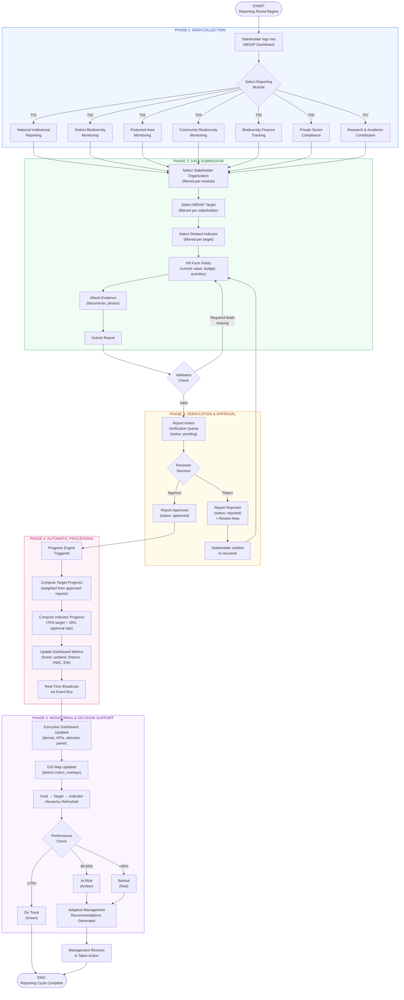
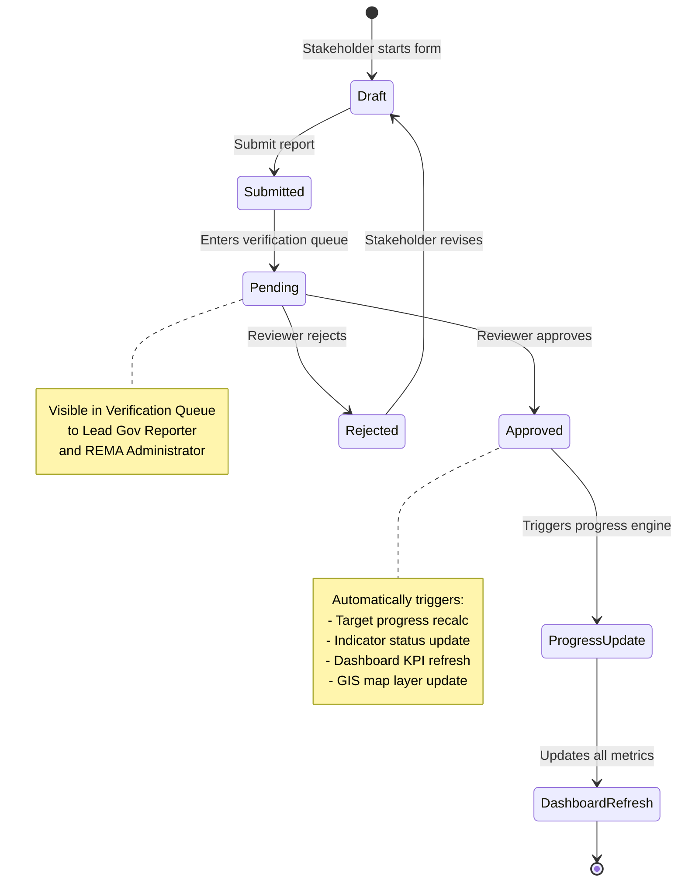
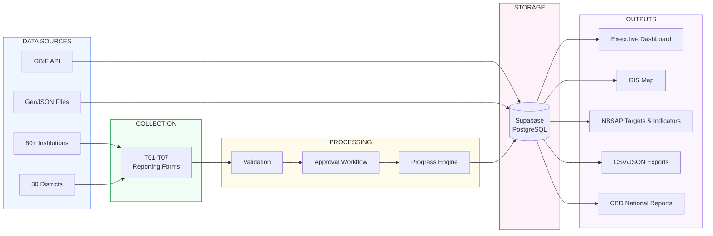

# NBSAP Monitoring System — Business Process Diagram

Copy the Mermaid code below into https://mermaid.live to generate the diagram image, then paste into your Word document.

---

## 1. Main Business Process Flow

---

## 2. Report Approval Workflow

---

## 3. Data Flow Summary

---

## Business Process Phases

| Phase | Description | Key Actors |
|-------|------------|------------|
| 1. Data Collection | Stakeholders select their reporting module (T01-T07) based on their institutional mandate | All reporters |
| 2. Data Submission | Fill form with target-linked data, attach evidence, submit | Reporters |
| 3. Verification | Reports enter queue for review by authorized reviewers | Lead Gov Reporter, REMA Admin |
| 4. Auto Processing | Approved reports trigger progress engine — target/indicator progress auto-calculated | System (automated) |
| 5. Decision Support | Dashboard, map, and hierarchy update in real-time for management review | All users (view), Management (act) |

## Key Business Rules

1. **Stakeholder filtering**: Each reporting module only shows stakeholders assigned to that tool
2. **Target filtering**: Each stakeholder only sees targets they are responsible for
3. **Indicator filtering**: Only indicators linked to the selected target are shown
4. **Progress calculation**: `Target Progress = SUM(approved_reports × tool_weight)`, clamped 0-100%
5. **Indicator progress**: `70% × target_progress + 30% × approval_rate`
6. **Status thresholds**: ≥70% = On Track (green), 40-69% = At Risk (amber), <40% = Behind (red)
7. **Real-time sync**: Approved reports trigger immediate dashboard and map updates via Supabase subscriptions
